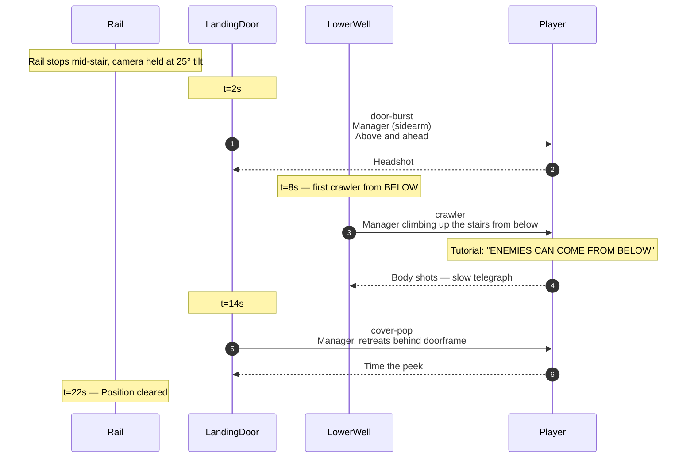
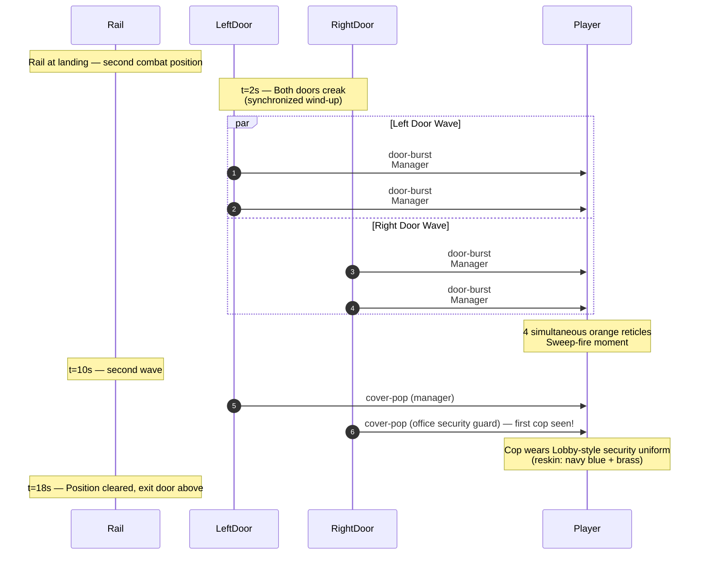

# Level 02 — Stairway A

> The elevator's broken. The auditor takes the stairs. Camera tilts up 25° as the rail begins to climb. A landing door bursts open above; a junior manager stumbles out with a coffee mug, sees the auditor, panics, fires.

## Theme

Concrete and metal — the back-of-house service stairwell. Industrial green metal handrails, exposed pipes overhead, fluorescent tube lights flickering, "THIS IS A FIRE EXIT" signage. Echoey footsteps; the ambience layer drops to almost nothing during traversal so the player hears their own boots on metal stairs.

The visual identity here is **vertical**. The cubicle floor was horizontal corridors; the stairway is straight UP. Camera tilt makes this immediate.

## Time budget

**Target: 60 seconds Normal**, comprising:

| Element | Seconds |
|---|---|
| Tilt transition + climb-start | 4 |
| Mid-stair combat position | 22 |
| Continued climb to landing | 12 |
| Landing-door wave | 18 |
| Top-of-stairs glide to next biome boundary | 4 |
| **Total** | **60s** |

This is the shortest level (Stairway A is gentle by design). Stairways B and C are longer.

## Rail topology

```mermaid
graph TB
    Top([🚪 Top<br/>Open Plan<br/>Door<br/>EXIT])
    Wave[🎯 Pos 2<br/>Landing Door<br/>Wave<br/>18s]
    Mid[🎯 Pos 1<br/>Mid-Stair<br/>22s]
    Bottom([🛗 Lobby<br/>Elevator<br/>SPAWN])

    Bottom -- "4s tilt + climb" --> Mid
    Mid -- "12s climb" --> Wave
    Wave -- "4s exit" --> Top

    style Bottom fill:#1a3050,stroke:#fff
    style Top fill:#3a3050,stroke:#fff
    style Wave fill:#502020,stroke:#f00
```



Rail length: ~14 world units of vertical climb. Camera pitch: -25° (looking up).

## Combat Position 1 — Mid-Stair

### Setup

Halfway up the first flight. Two doors visible: one on the upper landing (closed, source of the next beat-set), one on a tiny intermediate landing (background dressing, never opens).

Tutorial overlay (only on first-ever stair encounter): "ENEMIES CAN COME FROM BELOW TOO" — appears when the first crawler beat fires.

### Encounter flow



### Beat list (Normal)

| t | Beat | Enemy | Notes |
|---|---|---|---|
| 2.0s | door-burst | manager | Upper landing door |
| 8.0s | crawler | manager | From lower stairwell well — first time player sees this beat |
| 14.0s | cover-pop | manager | Same upper door, retreats |

Three enemies, all managers. No civilians. The crawler beat is the new vocabulary introduction.

## Combat Position 2 — Landing-Door Wave

### Setup

Top of the first full flight. The rail has climbed past the intermediate landing. A second flight continues up to the right; the player will exit through the door at the top of this new landing. But first, that door opens — and so does the door across the landing.

Both doors burst open simultaneously: the wave beat. 4-6 enemies pour onto the landing in a coordinated pop.

### Encounter flow



### Beat list (Normal)

| t | Beat | Enemy | Notes |
|---|---|---|---|
| 2.0s | door-burst (×2) | manager + manager | Left landing door |
| 2.0s | door-burst (×2) | manager + manager | Right landing door (synchronized) |
| 10.0s | cover-pop | manager | Left door cycle |
| 10.0s | cover-pop | office security guard | Right door cycle — FIRST OFFICE SECURITY GUARD of the run |

Six enemies; the synchronized 4-pop is the climax of Stairway A. Introduces the office security guard archetype.

## Set pieces

1. **The 25° tilt transition.** When the rail leaves the Lobby and enters the stairway, the camera smoothly tilts up over ~1 second. This is the "you are now ascending" cue. Reverse tilt happens at the top of the stairway as the rail enters Open Plan.

2. **The crawler from below (Pos 1, t=8s).** First time the player sees enemies coming from low Y. Tutorial-grade beat — the wind-up is generous (1.5s) and the enemy is visible climbing up the stairs.

3. **The synchronized landing wave (Pos 2, t=2s).** First time the player sees a synchronized multi-door pop. Sets up the mass-pop vocabulary that returns later in cubicle floors.

## Civilians

None. Stairways are service corridors — no office workers walk through. This is also a player-friendly choice — the tilted camera makes civilian recognition harder, and the player is still learning the verb set.

## Audio

- **Ambience layer**: minimal during traversal (echoing footsteps + dripping pipes synth) — `ambience-managers-only.ogg` faded to ~30%
- **Tilt transition**: subtle whoosh + low rumble
- **Crawler from below**: footsteps on metal, panting (background-shamble audio reused)
- **Wave doors creak**: door-creak sound from `pl_inventory_open_01.ogg` placeholder
- **Top of stairs**: ambience layer crossfades to Open Plan's `ambience-radio-chatter.ogg`

## Memory budget

Persistent from Lobby: hands, staple-rifle, manager GLB, manager material LUT entries. Loaded for Stairway A: metal-stairs GLB (existing `staircase-1.glb`), industrial-pipes prop, fluorescent-tube prop, 2 stairwell-door textures (from retro doors pool), office security guard GLB (first time loaded — use this stairway as the office security guard pre-load slot for Open Plan).

Total VRAM during Stairway A: ~25 MB (5 MB net add over Lobby; -10 MB Lobby-exclusive disposed during stair entrance, +15 MB for staircase + office security guard load).

## Authoring notes for implementation

- Camera tilt MUST be smooth, not stepped. Use a `useFrame` lerp over 1.0 second.
- The crawler enemy's climb animation needs to read clearly — use `walk` state on the existing manager but pitch the model -45° forward as a hack until proper crawl animations land.
- The synchronized wave needs both door wind-ups to start within 50ms of each other — humans perceive ≥80ms gap as "not synchronized." Use a single timer to gate both.
- The office security guard first appearance is a structural moment — don't hide it. Make sure the office security guard is the LAST enemy to die in the wave so the player gets a clean look at the new archetype.

## Construction primitives

Vertical level. Origin at bottom of stairs, ascending +Y. Camera pitches +25° on the rail tilt transition.

### Floors / ceilings (each landing)

| id | kind | origin | size | PBR |
|---|---|---|---|---|
| `floor-bottom` | floor | (0, 0, 0) | 4 × 4 | `laminate` (concrete tint) |
| `floor-mid-landing` | floor | (0, 3, 4) | 4 × 4 | `laminate` |
| `floor-top-landing` | floor | (0, 6, 8) | 4 × 4 | `laminate` |
| `ceiling-shaft` | ceiling | (0, 9, 4) | 6 × 12 | `ceiling-tile`, height 9, 4 emissive cutouts at 0.5 intensity (some flicker via cue) |

### Walls

| id | kind | origin | size | overlay |
|---|---|---|---|---|
| `wall-shaft-N` | wall | (-2, 0, 4) | 12 × 9 | drywall (concrete-tinted) |
| `wall-shaft-S` | wall | (2, 0, 4) | 12 × 9 | drywall |
| `wall-fire-exit-sign` | wall | (0, 1.5, 0) | 4 × 1.5 | drywall + `T_Window_Wood_002.png` overlay (FIRE EXIT signage) |

### Doors

| id | kind | origin | size | texture | family | spawnRailId |
|---|---|---|---|---|---|---|
| `door-mid-landing` | door | (0, 3, 5) | 1 × 2.2 | `T_Door_Metal_03.png` | metal | `rail-spawn-mid-landing` |
| `door-top-left` | door | (-1, 6, 9) | 1 × 2.2 | `T_Door_Metal_05.png` | metal | `rail-spawn-top-left` |
| `door-top-right` | door | (1, 6, 9) | 1 × 2.2 | `T_Door_Metal_06.png` | metal | `rail-spawn-top-right` |
| `door-exit-open-plan` | door | (0, 6, 11) | 1 × 2.2 | `T_Door_Metal_00.png` | metal | (none — exit only) |

### Props & lights

| id | kind | spec |
|---|---|---|
| `prop-staircase-1` | prop | `props/staircase-1.glb` at (0, 0, 0) |
| `prop-staircase-2` | prop | `props/staircase-2.glb` at (0, 3, 4) |
| `prop-pipes-overhead` | prop | `traps/trap-15.glb` at (0, 8.5, 4) (industrial pipe cluster) |
| `light-flicker-A` | point | (0, 8.5, 2), color (1.0, 1.0, 0.95), intensity 0.6 — FLICKERS during traversal via cue |
| `light-flicker-B` | point | (0, 8.5, 6), color (1.0, 1.0, 0.95), intensity 0.6 |
| `light-emergency-strip` | spot | (0, 6, 11), pointing +Z, intensity 0.0 initially — snaps on at top |

## Spawn rails

| id | path | speed | loop |
|---|---|---|---|
| `rail-spawn-mid-landing` | (0, 3, 6) → (0, 3, 5) → (0, 3, 4.5) | 2.0 m/s | false |
| `rail-spawn-mid-crawler` | (0, -1, 1) → (0, 0, 1) → (0, 0.5, 2) → (0, 1, 3) | 1.5 m/s | false |
| `rail-spawn-top-left` | (-1, 6, 10) → (-1, 6, 9) → (-1, 6, 8) | 2.5 m/s | false |
| `rail-spawn-top-right` | (1, 6, 10) → (1, 6, 9) → (1, 6, 8) | 2.5 m/s | false |

## Camera-rail nodes

| id | kind | position | lookAt | dwellMs |
|---|---|---|---|---|
| `enter` | glide | (0, 1.6, 0.5) | (0, 6, 4) | — |
| `pos-mid` | combat | (0, 2.5, 3) | (0, 6, 4) | 22000 |
| `pos-landing-wave` | combat | (0, 5.5, 7) | (0, 6, 9) | 18000 |
| `exit` | glide | (0, 6, 10) | (0, 6, 12) | — |

## Cue list (screenplay)

```ts
const stairwayACues: Cue[] = [
  // Tilt transition
  { id: 'amb-fade-down', trigger: { kind: 'wall-clock', atMs: 0 }, action: { verb: 'ambience-fade', layerId: 'managers-only', toVolume: 0.30, durationMs: 1500 } },
  { id: 'flicker-shaft', trigger: { kind: 'wall-clock', atMs: 200 }, action: { verb: 'lighting', lightId: 'light-flicker-A', tween: { kind: 'flicker', minIntensity: 0.4, maxIntensity: 0.7, hz: 6, durationMs: 60000 } } },

  // Position 1 — mid-stair (dwell 22s)
  { id: 'p1-door',        trigger: { kind: 'on-arrive', railNodeId: 'pos-mid' }, action: { verb: 'door', doorId: 'door-mid-landing', to: 'open' } },
  { id: 'p1-spawn-door',  trigger: { kind: 'on-arrive', railNodeId: 'pos-mid' }, action: { verb: 'enemy-spawn', railId: 'rail-spawn-mid-landing', archetype: 'middle-manager', fireProgram: 'pistol-pop-aim' } },
  { id: 'p1-spawn-crawl', trigger: { kind: 'on-arrive', railNodeId: 'pos-mid' }, action: { verb: 'enemy-spawn', railId: 'rail-spawn-mid-crawler', archetype: 'middle-manager', fireProgram: 'crawler-lunge' } },
  { id: 'p1-tut-below',   trigger: { kind: 'on-arrive', railNodeId: 'pos-mid' }, action: { verb: 'narrator', text: 'ENEMIES CAN COME FROM BELOW', durationMs: 2500 } },
  { id: 'p1-spawn-cover', trigger: { kind: 'on-arrive', railNodeId: 'pos-mid' }, action: { verb: 'enemy-spawn', railId: 'rail-spawn-mid-landing', archetype: 'middle-manager', fireProgram: 'pistol-cover-pop' } },

  // Position 2 — landing-door wave (dwell 18s, synchronised burst)
  { id: 'p2-door-L',      trigger: { kind: 'on-arrive', railNodeId: 'pos-landing-wave' }, action: { verb: 'door', doorId: 'door-top-left', to: 'open' } },
  { id: 'p2-door-R',      trigger: { kind: 'on-arrive', railNodeId: 'pos-landing-wave' }, action: { verb: 'door', doorId: 'door-top-right', to: 'open' } },
  { id: 'p2-spawn-L1',    trigger: { kind: 'on-arrive', railNodeId: 'pos-landing-wave' }, action: { verb: 'enemy-spawn', railId: 'rail-spawn-top-left', archetype: 'middle-manager', fireProgram: 'pistol-pop-aim' } },
  { id: 'p2-spawn-L2',    trigger: { kind: 'on-arrive', railNodeId: 'pos-landing-wave' }, action: { verb: 'enemy-spawn', railId: 'rail-spawn-top-left', archetype: 'middle-manager', fireProgram: 'pistol-pop-aim' } },
  { id: 'p2-spawn-R1',    trigger: { kind: 'on-arrive', railNodeId: 'pos-landing-wave' }, action: { verb: 'enemy-spawn', railId: 'rail-spawn-top-right', archetype: 'middle-manager', fireProgram: 'pistol-pop-aim' } },
  { id: 'p2-spawn-R2',    trigger: { kind: 'on-arrive', railNodeId: 'pos-landing-wave' }, action: { verb: 'enemy-spawn', railId: 'rail-spawn-top-right', archetype: 'security-guard', fireProgram: 'pistol-pop-aim' } }, // FIRST office security guard
  // Mid-position second wave is wall-clock-relative (10s into dwell)
  { id: 'p2-cover-L',     trigger: { kind: 'on-clear', railNodeId: 'pos-landing-wave' }, action: { verb: 'lighting', lightId: 'light-emergency-strip', tween: { kind: 'snap', intensity: 1.0 } } },

  // Exit
  { id: 'transition',     trigger: { kind: 'wall-clock', atMs: 60000 }, action: { verb: 'transition', toLevelId: 'open-plan' } },
];
```

## Validation

- Average Stairway A clear time on Normal: 55-65s
- Crawler beat success rate (player kills before lunge): >85% on Normal (this is a tutorial beat)
- Office Security Guard archetype recognition on first appearance: subjective playtest, but should NOT be missed. If playtests show players don't notice, slow the office security guard's spawn animation.
