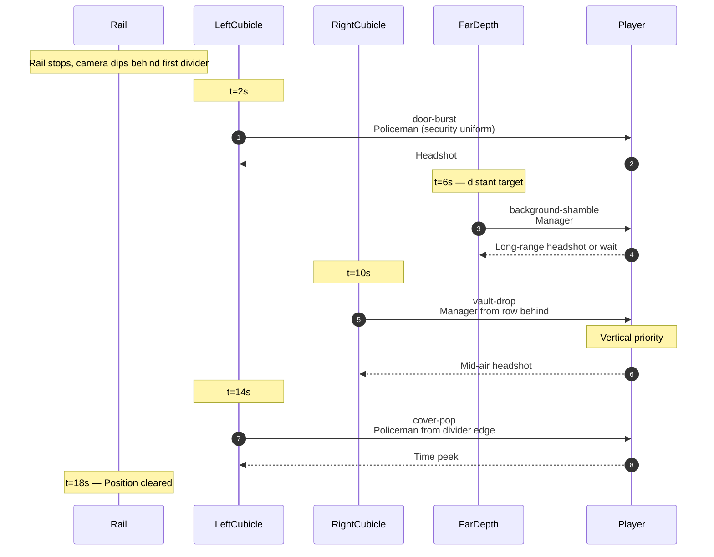
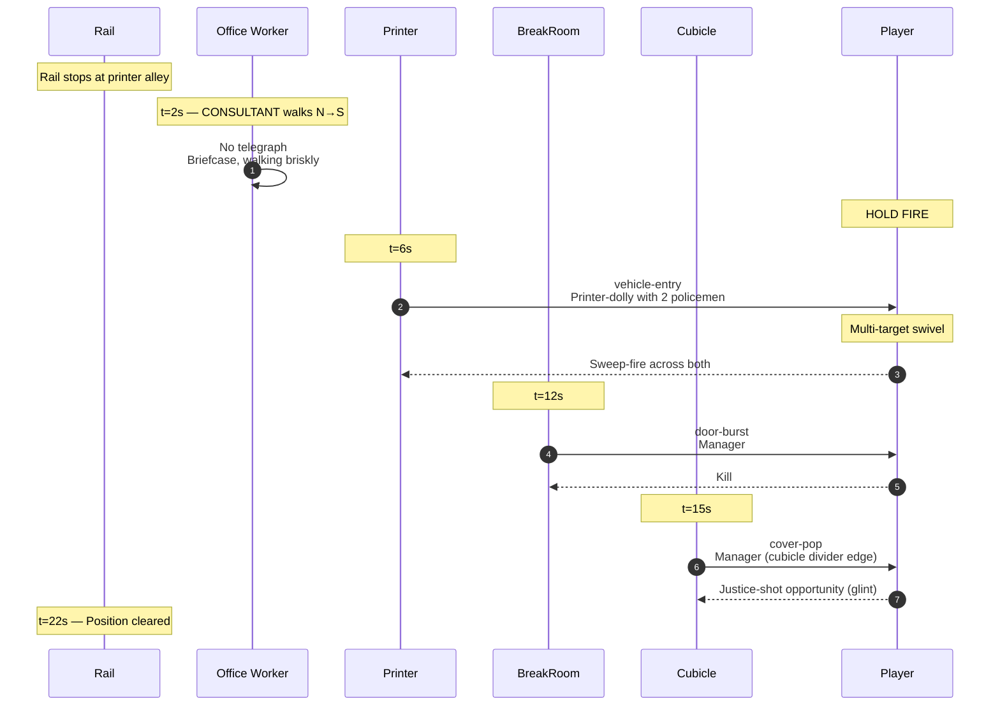
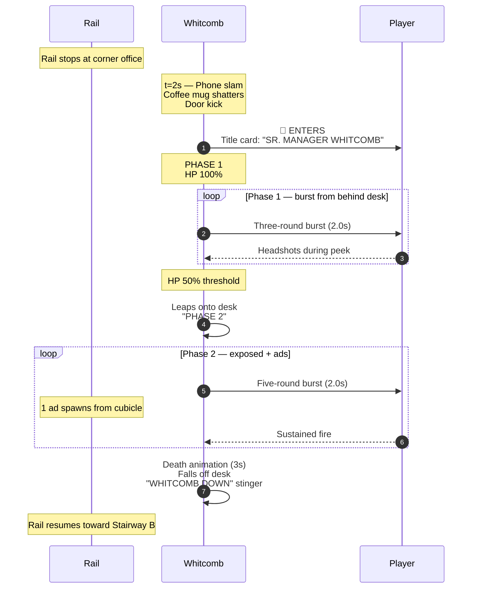

# Level 03 — The Open Plan

> Forty cubicles in three rows, every one identical, every one a potential ambush. The auditor walks the central aisle. A senior manager named Whitcomb runs the floor. Whitcomb believes in "synergy." Whitcomb is going to die.

## Theme

The cubicle sea. Acoustic-tile carpet, beige walls, sea-foam green cubicle dividers about chest-high. Every desk has a computer (CRT, dust). Plants on every fourth desk (the green ones, slightly dying). Above the cubicles: fluorescent tube grid in a 6m grid pattern. Near the far end, a glass-walled corner office labeled "WHITCOMB."

Visual identity: **horizontal claustrophobia.** The cubicle dividers create lots of vault-drop and cover-pop opportunities. The cubicle aisle is the rail. Visually wider than the Lobby but functionally tighter — every divider is potential cover for an enemy.

## Time budget

**Target: 75 seconds Normal**, comprising:

| Element | Seconds |
|---|---|
| Stairway A exit + tilt-down + ambience swap | 3 |
| Combat Position 1 — opening row | 18 |
| Glide to position 2 (~5 units) | 4 |
| Combat Position 2 — printer alley | 22 |
| Glide to position 3 (~5 units) | 4 |
| Combat Position 3 — Senior Manager Whitcomb | 22 |
| Exit to Stairway B | 2 |
| **Total** | **75s** |

## Rail topology

```mermaid
graph LR
    Start([🚪 Stairway A<br/>Exit<br/>SPAWN])
    P1[🎯 Pos 1<br/>Opening Row<br/>18s]
    P2[🎯 Pos 2<br/>Printer Alley<br/>22s]
    P3[💀 Pos 3<br/>Sr. Manager<br/>Whitcomb<br/>22s]
    End([🚪 Stairway B<br/>EXIT])

    Start -- "3s" --> P1
    P1 -- "4s glide" --> P2
    P2 -- "4s glide" --> P3
    P3 -- "2s" --> End

    style Start fill:#1a3050,stroke:#fff
    style End fill:#3a3050,stroke:#fff
    style P3 fill:#502020,stroke:#f00
```



Rail length: ~24 world units. Camera: level (no tilt).

## Combat Position 1 — Opening Row

### Setup

The first three cubicles, two on the left, one on the right with a wide gap. Each cubicle has a door (always closed initially). Whiteboards on the walls behind the cubicles list "GOALS Q1 2026: SYNERGY ACTUALIZATION."

### Encounter flow



### Beat list (Normal)

| t | Beat | Enemy | Notes |
|---|---|---|---|
| 2.0s | door-burst | policeman | Left cubicle |
| 6.0s | background-shamble | manager | Far down the aisle |
| 10.0s | vault-drop | manager | Right side, from row behind |
| 14.0s | cover-pop | policeman | Left cubicle divider |

Four enemies. Mix of manager + policeman. Establishes Open Plan's vault-drop tempo.

## Combat Position 2 — Printer Alley

### Setup

A cluster of office printers on the right side of the aisle (large, beige, paper trays). On the left, a "BREAK ROOM" door. Cubicles continue in three rows behind the printers. A water cooler stands at the divider between this position and the next.

The printers are visual cover for cover-pop beats AND mineable (crate-pop). One printer rolls forward as part of the vehicle-entry beat (dolly with two policemen on it).

### Encounter flow



### Beat list (Normal)

| t | Beat | Enemy / Type | Notes |
|---|---|---|---|
| 2.0s | civilian | consultant | DO NOT SHOOT |
| 6.0s | vehicle-entry | policeman + policeman | Printer-dolly |
| 12.0s | door-burst | manager | Break Room door |
| 15.0s | cover-pop + justice-opportunity | manager | Glint on weapon-hand |

Four enemies + 1 civilian. The vehicle-entry beat introduces the new vocabulary — it's Open Plan's signature beat type.

## Combat Position 3 — Mini-Boss: Senior Manager Whitcomb

### Setup

The corner office is glass-walled. Through the glass, the player can see Whitcomb's silhouette: a tall man in a beige suit, holding a coffee mug, gesturing at someone unseen on a phone. As the rail stops, Whitcomb slams the phone down, shatters his coffee mug against the wall, and kicks the glass office door open.

### Whitcomb's spec

A senior-manager reskin of the manager archetype: same GLB, larger scale (1.15×), beige suit material, red power tie, glasses prop. Coffee mug in left hand initially; he throws it as a visual cue at fight start (does no damage; theatrical).

| Difficulty | HP | Phase 1 attack | Phase 2 attack |
|---|---|---|---|
| Easy | 100 | Sidearm shot every 1.8s | Three-round burst every 2.5s |
| Normal | 150 | Three-round burst every 2.0s | Five-round burst every 2.0s + 1 ad |
| Hard | 200 | Five-round burst every 2.0s | Five-round burst every 1.5s + 2 ads |
| Nightmare | 260 | Five-round burst every 1.5s + 1 ad | Spray + 3 ads + lob |
| Ultra Nightmare | 320 | Spray + 2 ads | Spray + 4 ads + lob + cover-pop |

Phase 1: Whitcomb fires from behind his desk (cover). Player must time peeks against burst windows.

Phase 2 (HP threshold 50%): Whitcomb leaps onto the desk, fires more aggressively. Ads spawn from adjacent cubicles.

Weakpoint: head (250 score) or red tie (300 score — comedic). Justice-shot disarms the sidearm.

### Encounter flow



## Set pieces

1. **The vehicle-entry beat (Pos 2, t=6s).** First time the player sees a multi-target swivel scene. Printer-dolly is a comedic choice; visually distinct from anything in the Lobby.

2. **Whitcomb's phone slam (Pos 3 entry).** The visual cue signals the boss fight. The coffee mug shattering is timed to the title card animation.

3. **Whitcomb leaping onto the desk (Phase 2 transition).** Immediate visual cue that danger has escalated. The desk leap also exposes the red-tie weakpoint.

## Civilians

| Position | Civilian | Archetype |
|---|---|---|
| 1 | none | — |
| 2 | consultant | random: bald-suited or grey-skirt |
| 3 | none (boss fight) | — |

## Audio

- **Ambience layer**: `ambience-radio-chatter.ogg` (the "open-plan" canonical layer)
- **Whitcomb phone slam**: heavy-impact thud + glass shatter
- **Whitcomb leap onto desk**: stomp + chair clatter
- **Death stinger**: brief brass fanfare + workplace bell

## Memory budget

Persistent: hands, staple-rifle, manager + policeman GLBs. Loaded for Open Plan: cubicle-divider GLB (instanced 12-15 times), printer GLB (instanced 4 times), fluorescent-tube ceiling, water-cooler GLB (instanced 2 times), break-room door, glass-corner-office GLB, Whitcomb material LUT.

Total VRAM during Open Plan: ~32 MB.

Disposal: when entering Stairway B, dispose all Open Plan-exclusive geometry (printers, cubicle dividers, fluorescent tubes, water coolers, corner office). Keep manager + policeman GLBs loaded (reused in HR Corridor).

## Authoring notes

- Whitcomb's "synergy actualization" reading on the whiteboard at Position 1 is a plant — the boss is named in his own corporate jargon at the entrance to his floor. Make it readable but not blocking.
- Vehicle-entry's printer-dolly should rumble audibly (low-frequency synth) before it enters the player's view. Cue the player to look right.
- The corner office glass should be visually transparent enough that Whitcomb's silhouette reads from Position 2. This sets up the boss reveal — the player has been seeing him for ~30 seconds before the fight starts.

## Construction primitives

Cell-aligned cubicle field, 6 cells × 4 cells. Rail traverses the centre aisle. Whitcomb's office is the far +Z corner.

### Floors / ceiling

| id | kind | origin | size | PBR |
|---|---|---|---|---|
| `floor-cubicle-field` | floor | (0, 0, 12) | 24 × 24 | `carpet` |
| `ceiling-fluo-grid` | ceiling | (0, 3, 12) | 24 × 24 | `ceiling-tile`, height 3, 16 emissive cutouts (cool-white, intensity 0.7), 6×6 grid |

### Walls (perimeter)

| id | kind | origin | size | overlay |
|---|---|---|---|---|
| `wall-east` | wall | (12, 0, 12) | 24 × 3 | drywall |
| `wall-west` | wall | (-12, 0, 12) | 24 × 3 | drywall |
| `wall-end-glass` | wall | (0, 0, 24) | 24 × 3 | drywall + `T_Window_Wood_018.png` overlay (Whitcomb glass office wall) |

### Cubicle dividers (half-height walls)

15 cubicle dividers at chest height, sea-foam green tint via material override on drywall PBR. Cell-aligned at every 4m. Anchor positions enumerated in `src/levels/openPlan.ts`.

### Whiteboards

| id | kind | origin | size | caption |
|---|---|---|---|---|
| `wb-q1-goals` | whiteboard | (-12, 1, 4) | 4 × 1.5 | "GOALS Q1 2026: SYNERGY ACTUALIZATION" |
| `wb-okrs` | whiteboard | (12, 1, 8) | 4 × 1.5 | "OKR ALIGNMENT — H2" |
| `wb-whitcomb-self` | whiteboard | (-3, 1, 23) | 6 × 1.5 | "WHITCOMB" (boss-office signage) |

### Doors

| id | kind | origin | texture | family | spawnRailId |
|---|---|---|---|---|---|
| `door-cubicle-L1` | door | (-4, 0, 4) | `T_Door_PaintedWood_011.png` | painted-wood | `rail-spawn-L1` |
| `door-cubicle-R1` | door | (4, 0, 6) | `T_Door_PaintedWood_007.png` | painted-wood | `rail-spawn-R1-vault` |
| `door-break-room` | door | (-4, 0, 12) | `T_Door_Wood_009.png` | wood | `rail-spawn-break-room` |
| `door-cubicle-L2` | door | (-4, 0, 14) | `T_Door_PaintedWood_018.png` | painted-wood | `rail-spawn-L2-justice` |
| `door-whitcomb-office` | door | (0, 0, 24) | `T_Door_Wood_026.png` | wood | `rail-spawn-whitcomb` |

### Props & lights

| id | kind | spec |
|---|---|---|
| `prop-printer-dolly` | prop | `traps/trap-23.glb` (animated entry, midpoint of Position 2) |
| `prop-water-cooler` | prop | `traps/trap-8.glb` between Position 2 and 3 |
| `prop-whitcomb-desk` | prop | `props/desk.glb` at (0, 0, 23), scale 1.2 |
| `prop-coffee-mug` | prop | `traps/trap-19.glb` on Whitcomb desk (animated shatter on boss spawn) |
| `light-fluo-fill` | hemispheric | (0, 3, 12), color (1.0, 1.0, 0.95), intensity 0.5 |
| `light-whitcomb-spot` | spot | (0, 2.5, 23), pointing -Z, intensity 0.0 (snaps on at boss reveal) |

## Spawn rails

| id | path | speed | loop |
|---|---|---|---|
| `rail-spawn-L1` | (-5, 0, 5) → (-4, 0, 5) → (-3, 0, 4.5) | 2.5 m/s | false |
| `rail-spawn-shamble-far` | (0, 0, 22) → (0, 0, 12) | 1.0 m/s | false |
| `rail-spawn-R1-vault` | (5, 2.6, 7) → (5, 0, 7) → (5, 0, 6) | 5.0 m/s | false |
| `rail-spawn-L2-justice` | (-5, 0, 15) → (-4, 0, 15) → (-3, 0, 14.5) | 2.5 m/s | false |
| `rail-spawn-printer-dolly` | (12, 0.5, 12) → (5, 0.5, 12) | 2.5 m/s | false |
| `rail-spawn-printer-policeman-A` | (4, 0, 12) → (3, 0, 11) | 1.5 m/s | false |
| `rail-spawn-printer-policeman-B` | (4, 0, 12) → (3, 0, 13) | 1.5 m/s | false |
| `rail-spawn-break-room` | (-5, 0, 13) → (-4, 0, 13) → (-3, 0, 12.5) | 2.5 m/s | false |
| `rail-spawn-whitcomb` | (0, 0, 25) → (0, 0, 23.5) | 2.0 m/s | false |
| `rail-civ-consultant` | (-12, 0, 12.5) → (12, 0, 12.5) | 0.7 m/s | false |

## Camera-rail nodes

| id | kind | position | lookAt | dwellMs |
|---|---|---|---|---|
| `enter` | glide | (0, 1.6, 0) | (0, 1.6, 4) | — |
| `pos-1` | combat | (0, 1.6, 5) | (-3, 1.6, 6) | 18000 |
| `pos-2` | combat | (0, 1.6, 12) | (4, 1.6, 12) | 22000 |
| `pos-3` | combat | (0, 1.6, 21) | (0, 1.6, 24) | 22000 |
| `exit` | glide | (0, 1.6, 23.5) | (0, 1.6, 25) | — |

## Cue list (screenplay)

```ts
const openPlanCues: Cue[] = [
  { id: 'amb-radio',       trigger: { kind: 'wall-clock', atMs: 0 }, action: { verb: 'ambience-fade', layerId: 'radio-chatter', toVolume: 0.7, durationMs: 1000 } },
  { id: 'narr-floor',      trigger: { kind: 'wall-clock', atMs: 300 }, action: { verb: 'narrator', text: 'OPEN PLAN — FLOOR 7', durationMs: 1500 } },

  // Position 1 — opening row
  { id: 'p1-door-L1',      trigger: { kind: 'on-arrive', railNodeId: 'pos-1' }, action: { verb: 'door', doorId: 'door-cubicle-L1', to: 'open' } },
  { id: 'p1-spawn-L1',     trigger: { kind: 'on-arrive', railNodeId: 'pos-1' }, action: { verb: 'enemy-spawn', railId: 'rail-spawn-L1', archetype: 'security-guard', fireProgram: 'pistol-pop-aim' } },
  { id: 'p1-spawn-shamble',trigger: { kind: 'on-arrive', railNodeId: 'pos-1' }, action: { verb: 'enemy-spawn', railId: 'rail-spawn-shamble-far', archetype: 'middle-manager', fireProgram: 'shamble-march' } },
  { id: 'p1-door-R1',      trigger: { kind: 'on-arrive', railNodeId: 'pos-1' }, action: { verb: 'door', doorId: 'door-cubicle-R1', to: 'open' } },
  { id: 'p1-spawn-R1',     trigger: { kind: 'on-arrive', railNodeId: 'pos-1' }, action: { verb: 'enemy-spawn', railId: 'rail-spawn-R1-vault', archetype: 'middle-manager', fireProgram: 'vault-drop-fire' } },
  { id: 'p1-spawn-cover',  trigger: { kind: 'on-arrive', railNodeId: 'pos-1' }, action: { verb: 'enemy-spawn', railId: 'rail-spawn-L1', archetype: 'security-guard', fireProgram: 'pistol-cover-pop' } },

  // Position 2 — printer alley
  { id: 'p2-civ',          trigger: { kind: 'on-arrive', railNodeId: 'pos-2' }, action: { verb: 'civilian-spawn', railId: 'rail-civ-consultant' } },
  { id: 'p2-printer-anim', trigger: { kind: 'on-arrive', railNodeId: 'pos-2' }, action: { verb: 'prop-anim', propId: 'prop-printer-dolly', animId: 'roll-in' } },
  { id: 'p2-spawn-pol-A',  trigger: { kind: 'on-arrive', railNodeId: 'pos-2' }, action: { verb: 'enemy-spawn', railId: 'rail-spawn-printer-policeman-A', archetype: 'security-guard', fireProgram: 'vehicle-dismount-burst' } },
  { id: 'p2-spawn-pol-B',  trigger: { kind: 'on-arrive', railNodeId: 'pos-2' }, action: { verb: 'enemy-spawn', railId: 'rail-spawn-printer-policeman-B', archetype: 'security-guard', fireProgram: 'vehicle-dismount-burst' } },
  { id: 'p2-door-break',   trigger: { kind: 'on-arrive', railNodeId: 'pos-2' }, action: { verb: 'door', doorId: 'door-break-room', to: 'open' } },
  { id: 'p2-spawn-break',  trigger: { kind: 'on-arrive', railNodeId: 'pos-2' }, action: { verb: 'enemy-spawn', railId: 'rail-spawn-break-room', archetype: 'middle-manager', fireProgram: 'pistol-pop-aim' } },
  { id: 'p2-door-justice', trigger: { kind: 'on-arrive', railNodeId: 'pos-2' }, action: { verb: 'door', doorId: 'door-cubicle-L2', to: 'open' } },
  { id: 'p2-spawn-justice',trigger: { kind: 'on-arrive', railNodeId: 'pos-2' }, action: { verb: 'enemy-spawn', railId: 'rail-spawn-L2-justice', archetype: 'middle-manager', fireProgram: 'justice-glint' } },

  // Position 3 — Whitcomb
  { id: 'p3-coffee-shatter', trigger: { kind: 'on-arrive', railNodeId: 'pos-3' }, action: { verb: 'prop-anim', propId: 'prop-coffee-mug', animId: 'shatter' } },
  { id: 'p3-stinger',        trigger: { kind: 'on-arrive', railNodeId: 'pos-3' }, action: { verb: 'audio-stinger', audio: 'stingers/whitcomb-intro.ogg' } },
  { id: 'p3-spotlight',      trigger: { kind: 'on-arrive', railNodeId: 'pos-3' }, action: { verb: 'lighting', lightId: 'light-whitcomb-spot', tween: { kind: 'snap', intensity: 1.5 } } },
  { id: 'p3-door-whitcomb',  trigger: { kind: 'on-arrive', railNodeId: 'pos-3' }, action: { verb: 'door', doorId: 'door-whitcomb-office', to: 'open' } },
  { id: 'p3-boss',           trigger: { kind: 'on-arrive', railNodeId: 'pos-3' }, action: { verb: 'boss-spawn', bossId: 'whitcomb', phase: 1 } },

  { id: 'exit-stinger',      trigger: { kind: 'on-clear', railNodeId: 'pos-3' }, action: { verb: 'audio-stinger', audio: 'stingers/whitcomb-down.ogg' } },
  { id: 'transition',        trigger: { kind: 'wall-clock', atMs: 75000 }, action: { verb: 'transition', toLevelId: 'stairway-B' } },
];
```

## Validation

- Average Open Plan clear on Normal: 70-80s
- Civilian-shooting rate at this point: <30% (players have learned by now)
- Whitcomb Phase 2 reach rate: >90% (he should always make it to Phase 2)
- Whitcomb death rate by 30s: ~80% Normal, ~50% Hard, ~25% Nightmare, ~10% UN
