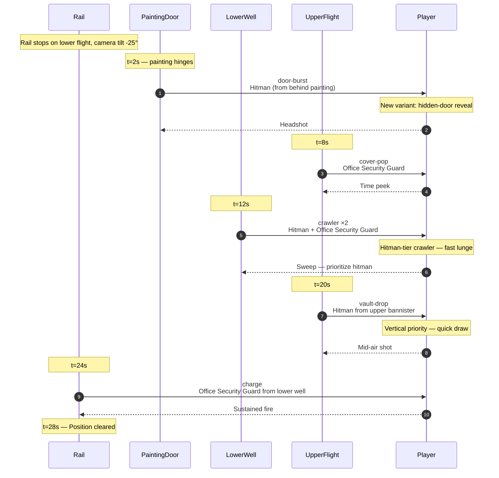
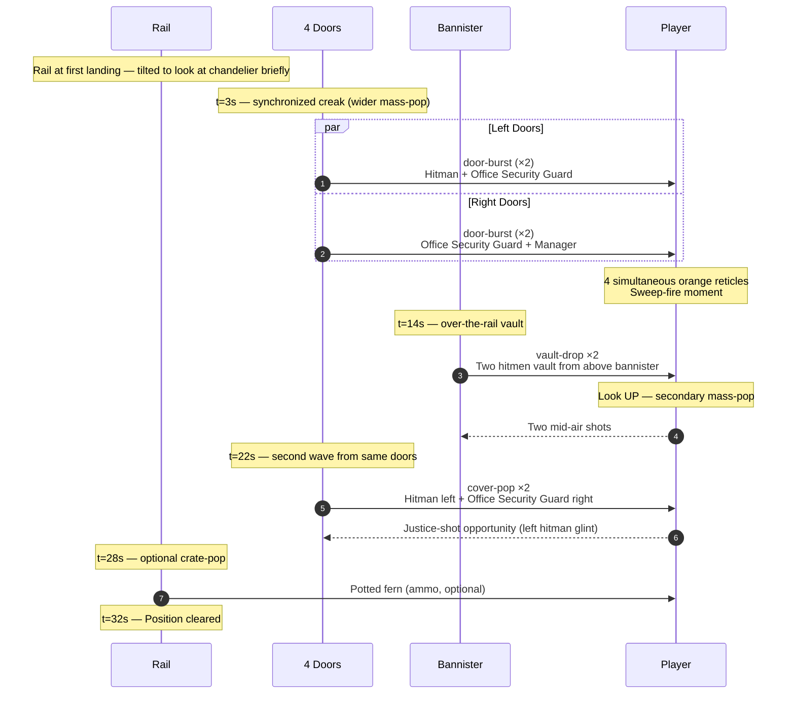
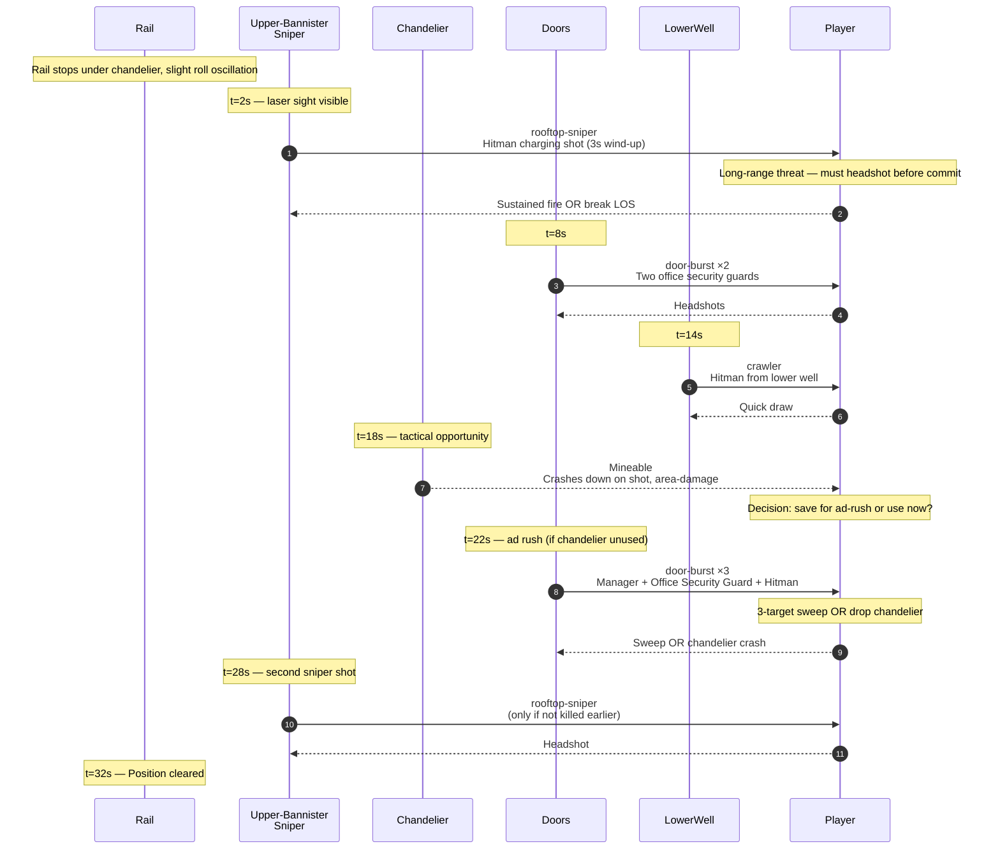

# Level 06 — Stairway C

> Phelps is dead. The auditor takes the executive stairs. These aren't the back-of-house service stairs — these are panelled walnut, brass handrails, oil paintings of past Directors of Operations on the wall. The building is now PERSONALLY offended. The resistance here is a defense, not a delay.

## Theme

Walnut panelling, brass-rail bannisters, plush red carpet runner up the center of the stairs. Oil paintings of grim, sepia-toned executives line the walls (each painting's eyes follow the rail — a deliberate horror-cabinet beat). Crystal chandelier overhead at the upper landing. The air feels expensive.

The visual identity contrasts brutally with Stairways A and B: those were industrial; this is **executive opulence weaponized.** The tilt-up returns at -25°, but the camera also adds a slight roll oscillation (~2° peak) on the rail to convey unease.

## Time budget

**Target: 120 seconds Normal**, comprising:

| Element | Seconds |
|---|---|
| Tilt transition + theme swap (carpet swallows boots again) | 4 |
| Combat Position 1 — lower flight | 28 |
| Climb to first landing | 8 |
| Combat Position 2 — first landing wave | 32 |
| Climb to mid-stair (oil-painting hallway) | 10 |
| Combat Position 3 — chandelier landing | 32 |
| Final climb to Executive door | 6 |
| **Total** | **120s** |

Twice the length of Stairway A and 33% longer than Stairway B. Three combat positions (vs. 2 in A and B). This is the longest stairway and the pre-boss difficulty peak.

## Rail topology

```mermaid
graph TB
    Top([🚪 Executive<br/>Suites Door<br/>EXIT])
    P3[💀 Pos 3<br/>Chandelier<br/>Landing<br/>32s]
    P2[🎯 Pos 2<br/>First Landing<br/>Wave<br/>32s]
    P1[🎯 Pos 1<br/>Lower Flight<br/>28s]
    Bottom([🚪 HR Corridor<br/>Stair Door<br/>SPAWN])

    Bottom -- "4s tilt + climb" --> P1
    P1 -- "8s climb" --> P2
    P2 -- "10s climb<br/>(oil-painting hallway)" --> P3
    P3 -- "6s exit" --> Top

    style Bottom fill:#1a3050,stroke:#fff
    style Top fill:#3a3050,stroke:#fff
    style P3 fill:#502020,stroke:#f00
```



Rail length: ~30 world units of vertical climb. Camera pitch: -25° base + ±2° roll oscillation.

## Combat Position 1 — Lower Flight

### Setup

The bottom of the executive stairwell. Two oil paintings flank the player at eye level on the lower wall — both portraits of Directors of Operations past, both staring directly at camera. The first painting has a hidden door behind it (will swing open later); the second is just dressing.

### Encounter flow



### Beat list (Normal)

| t | Beat | Enemy | Notes |
|---|---|---|---|
| 2.0s | door-burst (hidden) | hitman | First hidden-door reveal |
| 8.0s | cover-pop | office security guard | Upper flight |
| 12.0s | crawler ×2 | hitman + office security guard | Lower well |
| 20.0s | vault-drop | hitman | From upper bannister |
| 24.0s | charge | office security guard | Lower well |

Six enemies. The hidden-door reveal is Stairway C's signature new beat — paintings, vases, even one wall section will swing open as enemy doors. The player can't trust visual environment cues to mean "scenery only."

## Combat Position 2 — First Landing Wave

### Setup

Top of the first flight — a wide landing, brass railing on both sides overlooking the lower well. Four doors visible on this landing (more than any prior position): two left, two right. A potted fern stands in each corner (mineable, drops ammo). The chandelier is visible above through a circular ceiling cutout but not yet directly overhead.

### Encounter flow



### Beat list (Normal)

| t | Beat | Enemy | Notes |
|---|---|---|---|
| 3.0s | mass-pop ×4 | hitman + office security guard + office security guard + manager | 4-door synchronized burst |
| 14.0s | vault-drop ×2 | hitman + hitman | Over-the-bannister |
| 22.0s | cover-pop ×2 | hitman + office security guard | Door cycles |
| 28.0s | crate-pop | potted fern (optional) | Ammo |

Eight enemies + 1 optional crate. Larger than any prior mass-pop. The over-the-bannister vault-drop layer is new — the player must scan vertically AND horizontally simultaneously.

## Combat Position 3 — Chandelier Landing

### Setup

The mid-stair landing directly under the crystal chandelier. The chandelier is **mineable** — shoot it during this fight and it crashes down on the landing for area-clear damage to all enemies on the landing (a once-per-fight tactical option, like a smart-bomb pickup).

The combat opens with a **rooftop-sniper beat** — a hitman is positioned on the upper bannister of the next flight up, taking a slow charge-shot on the player. The chandelier, when crashed, takes out everyone on the floor but does NOT reach the upper-bannister sniper.

### Encounter flow



### Beat list (Normal)

| t | Beat | Enemy | Notes |
|---|---|---|---|
| 2.0s | rooftop-sniper | hitman | Upper bannister, laser-sight cue |
| 8.0s | door-burst ×2 | office security guard + office security guard | Landing doors |
| 14.0s | crawler | hitman | Lower well |
| 18.0s | (mineable) | chandelier | Tactical area-clear, optional |
| 22.0s | door-burst ×3 | manager + office security guard + hitman | Ad rush |
| 28.0s | rooftop-sniper (cond.) | hitman | Only fires if not killed at t=2s |

Six enemies + 3 ad-rush + 1 conditional sniper repeat = up to 10 enemies. The chandelier is a **tactical pickup** — the player chooses when to use it. This is the first taste of player tactical agency beyond shoot/cover.

## Set pieces

1. **The painting hidden-door (Pos 1, t=2s).** The first time a piece of "scenery" is revealed as an enemy spawn point. Sets up the run's final-act paranoia — anything could be a door now.

2. **The over-the-bannister vault-drop (Pos 2, t=14s).** First time enemies attack from a vertical direction the player can't see without explicit camera-up. Forces 3D scanning.

3. **The chandelier (Pos 3, t=18s).** First mineable tactical object that does AOE damage. Establishes the tactical-environment vocabulary used in Executive Suites and Boardroom (panic button, fire alarm, executive desk lamp).

4. **The oil-painting hallway between Pos 2 and Pos 3.** Rail glides past 6-8 portraits of past Directors of Operations. The eyes follow the camera. Each portrait's nameplate reads a date — they get progressively more recent. The last portrait is blank. (Foreshadowing.)

## Civilians

None. Even the executive stairwell is purged — the building has cleared civilians from the upper floors.

## Tactical objects

The chandelier is the only player-facing tactical object in the run — it is a destructible prop whose `prop-anim` cue (`crash`) triggers a level-event that kills all enemies within a 3m radius of the landing centre. Activated by 5 hits to the chandelier prop. Single-use, environmental, not a pickup.

## Audio

- **Ambience layer**: `ambience-clock-tick.ogg` — a slow grandfather-clock tick, deliberately old-fashioned. Sets the executive-floor unease.
- **Tilt transition**: muffled crescendo into ambience
- **Hidden-door painting hinge**: wood creak + dust-puff SFX
- **Mass-pop creak**: 4 doors synchronized within 50ms
- **Chandelier crash**: glass-shatter cascade + brass-bell BOOM, ~2s sustain
- **Sniper laser-sight**: subtle pure-tone whine during wind-up — directional audio cue

## Memory budget

Persistent from HR Corridor: hands, staple-rifle, manager + office security guard + hitman GLBs. Loaded for Stairway C: walnut-stair GLB (NEW — not the metal stairs from A/B), brass-rail prop, oil-painting GLB (instanced 8-10 times with material variants per portrait), chandelier-GLB (single instance), red-carpet-runner GLB, hidden-door-painting variant.

Total VRAM during Stairway C: ~33 MB (3 MB net add — walnut stair material + chandelier offsets disposed Stairway A/B metal stairs).

Disposal: when entering Executive Suites, dispose all stair-exclusive geometry (walnut stairs, oil paintings, chandelier), but keep red-carpet-runner GLB loaded (reused in Executive Suites).

## Authoring notes

- The painting-eyes-follow-camera effect is a per-portrait shader using a billboard quad masked to the eye region only. Cheap and uncanny. Don't apply to all portraits — only the 4 closest to the rail (anything further is invisible to camera).
- The chandelier mineable: 100 HP, takes 5 hits from staple-rifle to break. AOE on crash kills all enemies within 3 units of the landing center (excluding the upper-bannister sniper by design).
- The hidden-door painting reveals: the painting flips outward on a vertical hinge to its left. Use a single rotation animation on the painting node, no need for a separate door behind it.
- The slight roll oscillation on the rail: ±2° peak, sinusoidal, period 4s. Apply to camera quaternion, not the rail itself.
- Sniper laser-sight: a thin red emissive line from sniper position to player rail position. Only visible during wind-up (3s on Normal). The line MUST be unmissable but should not block targeting reticle visibility.

## Construction primitives

Walnut-and-brass executive stairwell. Three landings, ~10m total ascent. Camera tilts +30° (steeper than A and B). Subtle camera roll ±2° for unease.

### Floors / ceilings

| id | kind | origin | size | PBR |
|---|---|---|---|---|
| `floor-bottom` | floor | (0, 0, 0) | 4 × 4 | `laminate` (walnut tint) |
| `floor-mid-1` | floor | (0, 3, 5) | 6 × 4 | `laminate` (walnut + red-carpet runner) |
| `floor-mid-2` | floor | (0, 6, 10) | 6 × 4 | `laminate` (walnut + red-carpet runner) |
| `floor-top` | floor | (0, 9, 14) | 6 × 4 | `laminate` |
| `ceiling-shaft` | ceiling | (0, 13, 7) | 8 × 18 | `ceiling-tile`, height 13 (atrium-tall), one chandelier emissive cutout at intensity 1.0 |

### Walls (oil-painting hallway between Pos 2 and Pos 3)

| id | kind | origin | size | overlay |
|---|---|---|---|---|
| `wall-N` | wall | (-3, 0, 7) | 18 × 13 | drywall (walnut wainscoting) |
| `wall-S` | wall | (3, 0, 7) | 18 × 13 | drywall (walnut) |
| `wall-portrait-1` | wall | (-3, 1.5, 9) | 2 × 1.5 | drywall + `T_Window_Wood_005.png` overlay (Director portrait, 1987) |
| `wall-portrait-2` | wall | (3, 1.5, 9) | 2 × 1.5 | drywall + `T_Window_Wood_006.png` overlay (Director, 1995) |
| `wall-portrait-3` | wall | (-3, 1.5, 11) | 2 × 1.5 | drywall + `T_Window_Wood_007.png` overlay (Director, 2010) |
| `wall-portrait-4` | wall | (3, 1.5, 11) | 2 × 1.5 | drywall + `T_Window_Wood_008.png` overlay (Director, 2024 — eyes track) |
| `wall-portrait-blank` | wall | (-3, 1.5, 13) | 2 × 1.5 | drywall + `T_Window_Wood_009.png` overlay (BLANK — foreshadowing) |

### Doors

| id | kind | origin | texture | family | spawnRailId | state |
|---|---|---|---|---|---|---|
| `door-painting-hidden` | door | (3, 1.5, 4) | `T_Window_Wood_005.png` (painting facade) | wood | `rail-spawn-painting-hidden` | closed |
| `door-mid-1-L` | door | (-2, 3, 5) | `T_Door_Wood_018.png` | wood | `rail-spawn-mid-1-L` | closed |
| `door-mid-2-L` | door | (-2, 6, 10) | `T_Door_Wood_022.png` | wood | `rail-spawn-mid-2-L` | closed |
| `door-mid-2-R` | door | (2, 6, 10) | `T_Door_Wood_024.png` | wood | `rail-spawn-mid-2-R` | closed |
| `door-mid-2-S` | door | (0, 6, 11) | `T_Door_Wood_026.png` | wood | `rail-spawn-mid-2-service` | closed |
| `door-exit-executive` | door | (0, 9, 15) | `T_Door_Wood_028.png` | wood | (none — exit) | closed |

### Props & lights

| id | kind | spec |
|---|---|---|
| `prop-staircase-walnut-A` | prop | `props/staircase-1.glb` at (0, 0, 0) (walnut material override) |
| `prop-staircase-walnut-B` | prop | `props/staircase-2.glb` at (0, 3, 5) |
| `prop-staircase-walnut-C` | prop | `props/staircase-1.glb` at (0, 6, 10) |
| `prop-chandelier` | prop | `traps/trap-44.glb` at (0, 12, 10) (animated `crash` on 5 hits) |
| `prop-bannister` | prop | `traps/trap-30.glb` instanced along upper landing |
| `light-chandelier` | point | (0, 12, 10), color (1.0, 0.95, 0.85), intensity 0.8 |
| `light-emergency-strip-A` | spot | (0, 8.5, 5), pointing -Y, intensity 0.0 (snaps on at power-out) |

## Spawn rails

| id | path | speed | loop |
|---|---|---|---|
| `rail-spawn-painting-hidden` | (4, 1.5, 4) → (3, 1.5, 4) → (2, 0, 4) | 3.0 m/s | false |
| `rail-spawn-mid-1-L` | (-3, 3, 5) → (-2, 3, 5) → (-1, 3, 5) | 2.5 m/s | false |
| `rail-spawn-sniper-bannister` | (3, 12, 10) → (3, 11.5, 10) | 0.5 m/s (slow rise) | false |
| `rail-spawn-crawler-well` | (0, -1, 6) → (0, 0, 6) → (0, 1, 7) → (0, 2, 8) | 1.5 m/s | false |
| `rail-spawn-mid-2-L` | (-3, 6, 10) → (-2, 6, 10) → (-1, 6, 10) | 2.5 m/s | false |
| `rail-spawn-mid-2-R` | (3, 6, 10) → (2, 6, 10) → (1, 6, 10) | 2.5 m/s | false |
| `rail-spawn-mid-2-service` | (0, 6, 12) → (0, 6, 11) → (0, 6, 10.5) | 2.5 m/s | false |

## Camera-rail nodes

| id | kind | position | lookAt | dwellMs |
|---|---|---|---|---|
| `enter` | glide | (0, 1.6, 0.5) | (0, 6, 5) | — |
| `pos-1` | combat | (0, 2.5, 4) | (3, 1.5, 4) | 22000 |
| `pos-2` | combat | (0, 5, 8) | (3, 11.5, 10) | 28000 |
| `pos-3-ad-rush` | combat | (0, 8, 11) | (0, 6, 10) | 35000 |
| `exit` | glide | (0, 9, 14) | (0, 9, 16) | — |

## Cue list (screenplay)

```ts
const stairwayCCues: Cue[] = [
  { id: 'amb-clock',   trigger: { kind: 'wall-clock', atMs: 0 }, action: { verb: 'ambience-fade', layerId: 'tense-drone', toVolume: 0.5, durationMs: 2000 } },

  // Position 1 — painting hidden-door
  { id: 'p1-creak',     trigger: { kind: 'on-arrive', railNodeId: 'pos-1' }, action: { verb: 'audio-stinger', audio: 'stingers/painting-creak.ogg' } },
  { id: 'p1-door',      trigger: { kind: 'on-arrive', railNodeId: 'pos-1' }, action: { verb: 'door', doorId: 'door-painting-hidden', to: 'open' } },
  { id: 'p1-spawn',     trigger: { kind: 'on-arrive', railNodeId: 'pos-1' }, action: { verb: 'enemy-spawn', railId: 'rail-spawn-painting-hidden', archetype: 'hitman', fireProgram: 'pistol-pop-aim' } },
  { id: 'p1-door-mid',  trigger: { kind: 'on-arrive', railNodeId: 'pos-1' }, action: { verb: 'door', doorId: 'door-mid-1-L', to: 'open' } },
  { id: 'p1-spawn-mid', trigger: { kind: 'on-arrive', railNodeId: 'pos-1' }, action: { verb: 'enemy-spawn', railId: 'rail-spawn-mid-1-L', archetype: 'security-guard', fireProgram: 'pistol-cover-pop' } },

  // Position 2 — sniper + crawler dual axis
  { id: 'p2-sniper-spawn', trigger: { kind: 'on-arrive', railNodeId: 'pos-2' }, action: { verb: 'enemy-spawn', railId: 'rail-spawn-sniper-bannister', archetype: 'hitman', fireProgram: 'sniper-aim' } },
  { id: 'p2-doors',        trigger: { kind: 'on-arrive', railNodeId: 'pos-2' }, action: { verb: 'door', doorId: 'door-mid-2-L', to: 'open' } },
  { id: 'p2-spawn-L1',     trigger: { kind: 'on-arrive', railNodeId: 'pos-2' }, action: { verb: 'enemy-spawn', railId: 'rail-spawn-mid-2-L', archetype: 'security-guard', fireProgram: 'pistol-pop-aim' } },
  { id: 'p2-spawn-L2',     trigger: { kind: 'on-arrive', railNodeId: 'pos-2' }, action: { verb: 'enemy-spawn', railId: 'rail-spawn-mid-2-L', archetype: 'security-guard', fireProgram: 'pistol-pop-aim' } },
  { id: 'p2-crawler',      trigger: { kind: 'on-arrive', railNodeId: 'pos-2' }, action: { verb: 'enemy-spawn', railId: 'rail-spawn-crawler-well', archetype: 'hitman', fireProgram: 'crawler-lunge' } },

  // Position 3 — chandelier ad-rush
  { id: 'p3-power-out',  trigger: { kind: 'on-arrive', railNodeId: 'pos-3-ad-rush' }, action: { verb: 'level-event', event: 'power-out' } },
  { id: 'p3-emergency',  trigger: { kind: 'on-arrive', railNodeId: 'pos-3-ad-rush' }, action: { verb: 'lighting', lightId: 'light-emergency-strip-A', tween: { kind: 'snap', intensity: 0.8 } } },
  { id: 'p3-doors',      trigger: { kind: 'on-arrive', railNodeId: 'pos-3-ad-rush' }, action: { verb: 'door', doorId: 'door-mid-2-R', to: 'open' } },
  { id: 'p3-doors-S',    trigger: { kind: 'on-arrive', railNodeId: 'pos-3-ad-rush' }, action: { verb: 'door', doorId: 'door-mid-2-S', to: 'open' } },
  { id: 'p3-rush-1',     trigger: { kind: 'on-arrive', railNodeId: 'pos-3-ad-rush' }, action: { verb: 'enemy-spawn', railId: 'rail-spawn-mid-2-R', archetype: 'security-guard', fireProgram: 'pistol-pop-aim' } },
  { id: 'p3-rush-2',     trigger: { kind: 'on-arrive', railNodeId: 'pos-3-ad-rush' }, action: { verb: 'enemy-spawn', railId: 'rail-spawn-mid-2-service', archetype: 'middle-manager', fireProgram: 'pistol-cover-pop' } },
  { id: 'p3-rush-3',     trigger: { kind: 'on-arrive', railNodeId: 'pos-3-ad-rush' }, action: { verb: 'enemy-spawn', railId: 'rail-spawn-mid-2-R', archetype: 'hitman', fireProgram: 'pistol-pop-aim' } },

  { id: 'transition',    trigger: { kind: 'wall-clock', atMs: 120000 }, action: { verb: 'transition', toLevelId: 'executive' } },
];
```

## Validation

- Average Stairway C clear on Normal: 110-130s
- Player health average at Pos 3 entry: should be 60-80% (this is the pre-boss attrition peak)
- Chandelier usage rate: ~70% of players use it during ad-rush at t=22s. If lower, telegraph it harder via reticle highlight.
- Sniper kill-before-commit rate: >75% on Normal (reticle wind-up is generous on Normal; tighter on Hard+)
- Hidden-door painting recognition: subjective playtest — players should NOT die to hidden-door surprises. The painting hinge should be telegraphed by a visible squeak + dust-puff before the burst.
