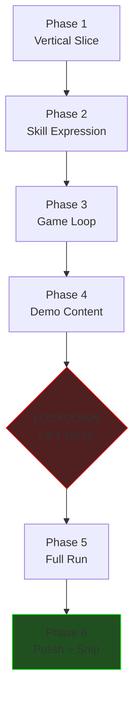

# Arcade Rail Shooter — Build Plan

The complete delivery plan from the locked design (`docs/superpowers/specs/arcade-rail-shooter/`) to feature-complete game. Organized as Phases 1–6 (per `00-overview.md` §Implementation phasing), with PRQs (Pull-Request Quanta) inside each phase as commit-boundary units.

**Single topic branch policy:** `wire-everything` already exists and carries the doc commit (e4833f2). Each Phase ships as ONE squash-merged PR; PRQs inside a phase are commit boundaries, not PR boundaries (per CLAUDE.md operating rules).

**Lockdown lift gate:** end of Phase 4. No `pnpm dev` / browser-mode / headed playwright until that gate clears with explicit user approval.

## Code retention vs. deletion

Already documented in `.agent-state/directive.md`. Summary: keep weapon roster + GLBs + audio + textures + Capacitor + drizzle + UI primitives + i18n. Delete voxel chunks + floor system + maze + navmesh + tap-to-walk + radial menus + workbench + per-floor mining.

Deletions happen in **Phase 1 PRQ-1.0** as a clean-slate prep commit before any rail-shooter code lands.

---

## Phase 1 — Vertical slice

**Goal:** rail + camera + 1 weapon (sidearm) + 1 enemy (manager) + 1 beat (door-burst). Headless playable. Validates core verb loop.

**Branch:** `wire-everything` (continues).

**Test strategy:** vitest node only. No browser tests until lockdown lifts.

| PRQ | Subject | Files | Validates |
|---|---|---|---|
| 1.0 | Clean slate — delete voxel/floor/maze/navmesh code | bulk delete + `app/views/Game.tsx` simplified | tsc clean; node tests green |
| 1.1 | Rail data structure + RailNode graph + level seed | `src/rail/Rail.ts`, `src/rail/RailNode.ts` | unit tests on rail traversal |
| 1.2 | Camera-on-rail (`<RailCamera/>` R3F mount + lerp + pitch/yaw control) | `src/render/rail/RailCamera.tsx` | mounts in node-side jsdom test |
| 1.3 | Reticle 3-state controller (`green/orange/red`) keyed off `windupMs/commitMs` | `src/encounter/Reticle.ts` + `<Reticle/>` HUD | unit + jsdom snapshot |
| 1.4 | Aim controller (cursor → world ray; finger drag for mobile) | `src/input/AimController.ts` | unit |
| 1.5 | Weapon: sidearm hitscan tick (reuses `src/combat/hitscan.ts`) | adapter into the rail loop | unit |
| 1.6 | Enemy: `<RailEnemy/>` minimal manager spawn + telegraphed fire + death | `src/render/rail/RailEnemy.tsx` | unit + jsdom |
| 1.7 | Beat: `door-burst` handler → spawns RailEnemy with door GLB swing | `src/encounter/beats/door-burst.ts` | unit |
| 1.8 | Combat-position runner (timeline → fires beats at `t` offsets) | `src/encounter/Position.ts` | unit |
| 1.9 | Lobby Position 1 only (3 beats from Lobby spec) — playable in jsdom | `src/levels/lobby.ts` | integration unit |
| 1.10 | Wire it all in `app/views/Game.tsx` — replace prior content | `app/views/Game.tsx` | typecheck + node test on `<Game/>` mount |

After Phase 1: `<Game/>` mounts, rail advances to Pos 1, three door-bursts fire with telegraphed reticles, player can shoot with mouse, manager dies and the rail glides to a "FIN" stub.

## Phase 2 — Skill expression layer

**Goal:** cover + reticle + 5 beats + civilians. Player skill expressed.

**Branch:** new branch `phase-2-skill-expression` after Phase 1 PR merges, OR continue `wire-everything` if Phase 1 hasn't pushed yet.

| PRQ | Subject | Files |
|---|---|---|
| 2.0 | Cover system — tap/hold to drop camera below rail; auto-pop on release timer | `src/rail/CoverController.ts`, HUD button |
| 2.1 | Beat: `cover-pop` | `src/encounter/beats/cover-pop.ts` |
| 2.2 | Beat: `vault-drop` (mid-air target, vault GLB anim) | `src/encounter/beats/vault-drop.ts` |
| 2.3 | Beat: `crawler` (low-Y aim) | `src/encounter/beats/crawler.ts` |
| 2.4 | Beat: `background-shamble` (long-range walker) | `src/encounter/beats/background-shamble.ts` |
| 2.5 | Beat: `charge` (cover-ignoring sprint) | `src/encounter/beats/charge.ts` |
| 2.6 | Civilians — `civilian` beat handler + civilian GLB rig + walk path | `src/encounter/beats/civilian.ts`, `src/render/rail/Civilian.tsx` |
| 2.7 | Score events — civilian penalty (-500), HP loss, audio sting | `src/score/events.ts` |
| 2.8 | Reticle differentiates civilian vs hostile (`blue` for civilian) | `src/encounter/Reticle.ts` extension |
| 2.9 | Lobby Position 1 + 2 with all 5 beats + civilian | `src/levels/lobby.ts` extended |

After Phase 2: a player can clear the first two Lobby positions while making the cover/civilian/aim decisions the design intends.

## Phase 3 — Game-loop layer

**Goal:** scoring + combo + UI shell + difficulty grid wired.

| PRQ | Subject | Files |
|---|---|---|
| 3.0 | Score computation — body/head/justice/civilian + combo cap | `src/score/score.ts` |
| 3.1 | Combo HUD (1×–2.5× indicator) | `src/ui/ComboHud.tsx` |
| 3.2 | Justice-shot detection (weapon-hand hitbox + glint cue) | `src/combat/justice.ts` |
| 3.3 | Cabinet shell — title screen + difficulty picker (2×5 grid) | `app/views/Cabinet.tsx` (new) |
| 3.4 | Permadeath toggle + lives counter + score multiplier wiring | `src/score/difficulty.ts` |
| 3.5 | Game-over screen (score, run time, "ANOTHER COIN") | `app/views/RunOver.tsx` |
| 3.6 | Persistence — save high score per difficulty entry | drizzle schema migration |
| 3.7 | Adaptive difficulty — Razing Storm hitless-streak windup shrink | `src/encounter/Reticle.ts` |
| 3.8 | Ammo HUD + reload button + per-weapon ammo counter | `src/ui/AmmoHud.tsx` |

After Phase 3: cabinet → Lobby Pos 1+2 → game over screen → repeat loop. Score persists.

## Phase 4 — Demo content (Lobby + Stair A + Boardroom + Reaper)

**Goal:** smallest content-complete vertical that proves the level system works on the smallest level set. After this phase, OOM lockdown lift gate.

| PRQ | Subject | Files |
|---|---|---|
| 4.0 | Level loader — bounded asset GLBs, dispose on rail-leave | `src/levels/LevelLoader.ts` |
| 4.1 | Lobby (full) — 3 positions, intern set piece, mini-boss Garrison | `src/levels/lobby.ts` complete |
| 4.2 | Stairway A (full) — tilt camera + 2 positions + crawler intro + first policeman | `src/levels/stairwayA.ts` |
| 4.3 | Mini-boss Garrison — phase-1/phase-2 patterns + briefcase weakpoint | `src/encounter/bosses/garrison.ts` |
| 4.4 | Boardroom level shell — single-room arena, Reaper present | `src/levels/boardroom.ts` |
| 4.5 | Reaper — Phase 1 REDACT (HUD bar projectile + iPad mineable) | `src/encounter/bosses/reaper.phase1.ts` |
| 4.6 | Reaper — Phase 2 TELEPORT (4-pos cycle + scythe-slash + ads) | `src/encounter/bosses/reaper.phase2.ts` |
| 4.7 | Reaper — Phase 3 SUBPOENA (lob + mass-pop ads + scythe disarm) | `src/encounter/bosses/reaper.phase3.ts` |
| 4.8 | Audio — ambience layers per level + boss themes + stingers | `src/audio/AmbienceController.ts` |
| 4.9 | Demo run wired Lobby → StairA → Boardroom (skip Open Plan/HR/StairB/StairC/Exec) | `src/levels/demoRun.ts` |
| 4.10 | Memory dispose verification — node-test that asserts level loader frees materials | `tests/node/memory-dispose.test.ts` |

**LOCKDOWN LIFT GATE.** After Phase 4 commits land: I'll prepare ONE controlled headless playwright spec with `--max-old-space-size=2048` to walk Lobby → Stair A → Boardroom and assert heap stays bounded. User explicit approval needed before that spec runs. After it's green, lockdown lifts and Phases 5+ can use browser tests.

## Phase 5 — Full canonical run

**Goal:** Open Plan + Stairway B + HR + Stairway C + Executive + their mini-bosses. Now we have the full 9-level run.

| PRQ | Subject | Files |
|---|---|---|
| 5.0 | Beat: `vehicle-entry` (printer-dolly multi-target swivel) | `src/encounter/beats/vehicle-entry.ts` |
| 5.1 | Beat: `drive-by` | `src/encounter/beats/drive-by.ts` |
| 5.2 | Beat: `rooftop-sniper` (laser-sight cue) | `src/encounter/beats/rooftop-sniper.ts` |
| 5.3 | Beat: `lob` (mid-air shootable projectile) | `src/encounter/beats/lob.ts` |
| 5.4 | Beat: `hostage` (precision-only) | `src/encounter/beats/hostage.ts` |
| 5.5 | Beat: `crate-pop` (mineable cabinets/coolers/cabinets) | `src/encounter/beats/crate-pop.ts` |
| 5.6 | Beat: `mass-pop` (synchronized 4-8 cover-pops) | `src/encounter/beats/mass-pop.ts` |
| 5.7 | Beat: `justice-opportunity` (layered scoring tier) | `src/encounter/beats/justice-opportunity.ts` |
| 5.8 | Open Plan (full) — 3 positions, vehicle-entry, mini-boss Whitcomb | `src/levels/openPlan.ts` |
| 5.9 | Mini-boss Whitcomb — coffee-mug throw + desk-leap phase 2 | `src/encounter/bosses/whitcomb.ts` |
| 5.10 | Stairway B (full) — propped door + mass-pop + first hitman | `src/levels/stairwayB.ts` |
| 5.11 | HR Corridor (full) — frosted glass + hostage room + Phelps | `src/levels/hrCorridor.ts` |
| 5.12 | Mini-boss Phelps — filing-cabinet cover + binder-lob phase 2 | `src/encounter/bosses/phelps.ts` |
| 5.13 | Stairway C (full) — hidden-door + chandelier + sniper | `src/levels/stairwayC.ts` |
| 5.14 | Executive Suites (full) — pre-aggro lounge + ceiling vents + Crawford | `src/levels/executive.ts` |
| 5.15 | Mini-boss Crawford — silent shotgun + desk-flip phase 2 | `src/encounter/bosses/crawford.ts` |
| 5.16 | Full-run wiring: 9-level sequence | `src/levels/canonicalRun.ts` |
| 5.17 | Per-level memory budget enforcement (peak-VRAM assertions in dev) | `src/levels/budgetGuard.ts` |
| 5.18 | Headed playwright e2e — full run on Easy clears in ~7-8 min | `tests/e2e/full-run.spec.ts` |

## Phase 6 — Replay loop + retention

**Goal:** difficulty selector + permadeath + daily challenge + leaderboards + polish + ship.

| PRQ | Subject | Files |
|---|---|---|
| 6.0 | Daily challenge — UTC-date-seeded modifier roll + run gate | `src/score/dailyChallenge.ts` |
| 6.1 | Modifier pool (~18 modifiers from `03-difficulty-and-modifiers.md`) | `src/score/modifiers.ts` |
| 6.2 | Per-difficulty unlocks (Hard requires N-3 clear, etc.) | `src/score/unlocks.ts` |
| 6.3 | Leaderboard scaffolding (local-first, daily-challenge separate) | `src/score/leaderboard.ts` |
| 6.4 | Cabinet UI v2 — leaderboards visible + daily-challenge button | `app/views/Cabinet.tsx` |
| 6.5 | Tutorial overlays — first-time-player cues per beat introduction | `src/ui/TutorialOverlays.tsx` |
| 6.6 | Pause menu — settings, audio mix, sensitivity, color-blind reticle palette | `app/views/PauseMenu.tsx` rewrite |
| 6.7 | Performance pass — instancing audit, draw-call budget, pre-load next-level pattern | `src/render/perf/` |
| 6.8 | Mobile shell — Capacitor-wrap, touch tap-and-hold for cover, drag-aim | `src/input/MobileInput.ts` |
| 6.9 | Audio polish — final mix, per-level ambience tuning, boss theme stems | audio/* |
| 6.10 | Visual polish — palette pass per level, lighting tuning, post-process LUT | `src/render/postprocess/` |
| 6.11 | Localization scaffold — i18n keys for all UI strings | `src/i18n/` extended |
| 6.12 | Accessibility — color-blind palettes, audio cues for visual events, large-text option | `src/i18n/a11y.ts` |
| 6.13 | Save robustness — drizzle migrations + import/export blob + corruption recovery | `src/db/` extended |
| 6.14 | Release CI/CD — release-please tags + Pages deploy + Capacitor native AAB/IPA jobs | `.github/workflows/` |
| 6.15 | Final QA pass — full-run e2e at every difficulty entry; daily-challenge spec | `tests/e2e/` |

After Phase 6: feature-complete. Ship.

## Asset acquisition (parallel track)

These can land at any time; not on the critical path of Phase 1-3 but blocking for Phase 4+:

| Asset | Source | Notes |
|---|---|---|
| FPS hands GLB | already shipped (`public/assets/models/hands/fps-arms.glb`) | done |
| 6 weapon GLBs | already shipped | done |
| 4 enemy GLBs (manager/policeman/hitman/swat) | already shipped | done |
| Reaper GLB | needs custom auth (see `08-boardroom.md` notes) | **Phase 4 blocker** |
| Civilian GLBs (intern/consultant/executive) | retexture worker | **Phase 2 blocker** |
| Reception desk GLB (Lobby) | from prop pack or new | Phase 4 blocker |
| Boardroom table GLB | from prop pack or new | Phase 4 blocker |
| Stair GLBs | already shipped (`staircase-1.glb`, `staircase-2.glb`) | done |
| Cubicle dividers GLB | from prop pack or new | Phase 5 blocker |
| Office printer GLB (vehicle-entry) | from prop pack or new | Phase 5 blocker |
| Filing cabinet GLB | already shipped | done |
| Door GLBs/textures | already shipped (240 retro doors) | done |
| Audio (66 files) | already shipped | done |

For the alpha (Phase 4), the only NEW asset that absolutely must be authored is the Reaper. Every other gap can be filled with reskins / placeholders with a `TODO_ASSET` flag.

## Dependency graph (high-level)

## Operating rules during the build

1. **Lockdown stays in effect through Phase 4.** No `pnpm dev`, no `pnpm test:browser`, no headed playwright. All testing through `pnpm typecheck` + `pnpm lint` + `pnpm test:node`.
2. **One PRQ = one local commit.** Conventional commit prefix; PRQ id in body. After commit, dispatch the parallel review trio (`comprehensive-review:full-review` + `security-scanning:security-sast` + `code-simplifier:code-simplifier`) in background. Fold findings into the next forward commit.
3. **Each phase = one squash-merged PR** to main once all PRQs land cleanly.
4. **Stubs/TODOs/`as any` are bugs.** Fix or delete before claiming a PRQ done.
5. **Memory dispose discipline.** Every R3F mount has a `useEffect` cleanup that disposes BufferGeometry, Materials, Textures, BVH, Audio sources, NavMesh hosts (when applicable). The pattern from commit 577eb2c is canon.
6. **Determinism.** All gameplay RNG goes through `createRng(seed)` from `src/world/generator/rng.ts` — even after the world generator is deleted, that file moves to `src/shared/rng.ts` and stays. No `Math.random()` in gameplay code.
7. **Tests reify spec lines.** Per `ts-browser-game.md` profile: every spec claim has an assertion. Visual baselines come back online after lockdown lifts.

## Out of scope for v1

- Multiplayer / co-op
- Custom-mapped weapons (only the 6 in the roster)
- Mid-run shop / loot / RPG mechanics
- Procedural level generation (levels are hand-crafted)
- Mission-length presets (single canonical run)
- Day/night cycle / weather
- Outdoor biomes
- Skeletal animations on civilians (uniform shader-driven hop-walk only — per CLAUDE.md)
- Viewmodel arms IK (T-pose hands only — per CLAUDE.md)
- Fog (chunk culling gates draw distance — per CLAUDE.md, though chunks themselves are gone, the rule that there's no fog stays)
