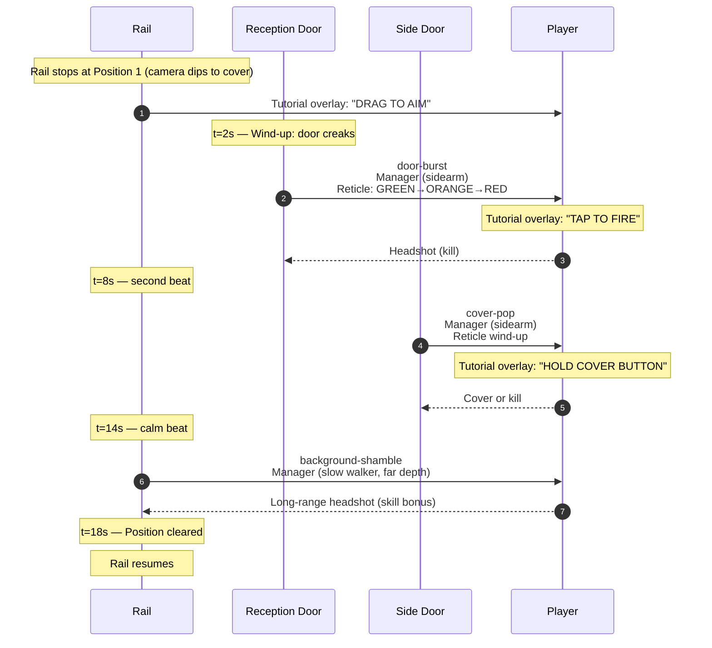
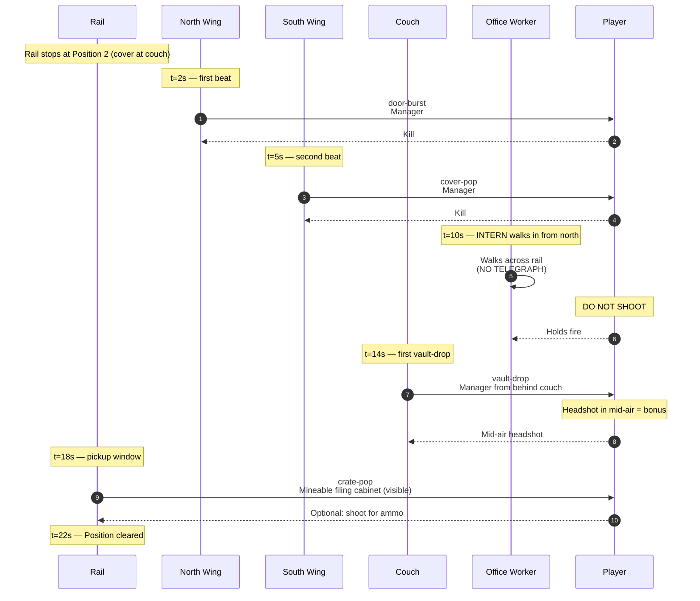
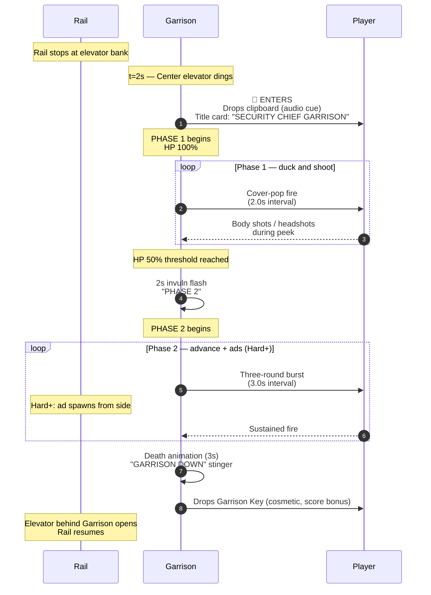

# Level 01 — The Lobby

> The auditor enters through the front doors. The receptionist is gone, but her radio is still on. Security guards round the corner of the marble lobby with sidearms drawn. By the time the elevator dings open, the player has had their first kill, learned the cover button, and watched an intern walk through the line of fire.

## Theme

Marble floors, glass-brick exterior walls, polished brass trim, leather couches, fern in a brass pot. A reception desk dominates the foreground. Above it, a pendulum-style office clock ticks (audible). A revolving door at the rail's start; an elevator at the rail's end (visible from the start, beckons the player forward). Painted on the wall in stencil: "DEPARTMENT OF REDUNDANCY DEPARTMENT — FLOOR DIRECTORY 1-47."

This is the tutorial level — it teaches the verbs through deliberate authoring. Pacing is gentler than every subsequent level. First-time players should make it through Lobby on a first try; veterans clear it in ~50 seconds.

## Time budget

**Target: 75 seconds Normal**, comprising:

| Element | Seconds |
|---|---|
| Rail entrance (revolving door, ambience swell) | 3 |
| Combat Position 1 — front desk | 18 |
| Glide to position 2 (~5 units of rail) | 4 |
| Combat Position 2 — concourse | 22 |
| Glide to position 3 (~6 units) | 4 |
| Combat Position 3 — Security Chief Garrison (mini-boss) | 22 |
| Exit glide to elevator + ding + door open | 2 |
| **Total** | **75s** |

## Rail topology

```mermaid
graph LR
    Start([🚪 Revolving<br/>Door<br/>SPAWN])
    P1[🎯 Pos 1<br/>Front Desk<br/>15s]
    P2[🎯 Pos 2<br/>Concourse<br/>22s]
    P3[💀 Pos 3<br/>Security Chief<br/>Garrison<br/>22s]
    End([🛗 Elevator<br/>EXIT])

    Start -- "3s" --> P1
    P1 -- "4s glide" --> P2
    P2 -- "4s glide" --> P3
    P3 -- "2s ding" --> End

    style Start fill:#1a3050,stroke:#fff
    style End fill:#1a5030,stroke:#fff
    style P3 fill:#502020,stroke:#f00
```

Rail length: ~22 world units (cell size 4u × 5.5 cells of forward travel). Camera height: 1.6u. Camera FOV: 70°.

## Combat Position 1 — Front Desk

### Setup

The rail stops directly in front of the reception desk. Desk is to the player's left; a wide-open lobby extends to the right. Behind the desk, a closed wood door (Office of First Impressions). On the opposite wall, two cubicle doors (locked, not used in this position). Reception sign reads: "PLEASE HAVE YOUR EMPLOYEE ID READY."

Tutorial overlays (only on first-ever run, never replayed):
- **0:00** "DRAG TO AIM" — appears as the cursor moves
- **0:02** "TAP TO FIRE" — appears when an enemy enters orange-reticle state
- **0:08** "HOLD COVER BUTTON TO HIDE" — appears when the second enemy fires

### Encounter flow

### Beat list (Normal)

| t | Beat | Enemy | Notes |
|---|---|---|---|
| 2.0s | door-burst | manager | Reception door; tutorial frame |
| 8.0s | cover-pop | manager | Side cubicle wall; tutorial cover |
| 14.0s | background-shamble | manager | Far-depth corridor; reward early shot |

Three enemies. All managers (lowest tier). No civilians in this position.

### Memory budget

Loaded for Position 1: hands GLB, staple-rifle GLB, manager GLB (instanced 3×), 3 door textures, marble floor texture, glass-brick wall texture, reception desk GLB, ambience layer (managers-only). ~22 MB VRAM.

## Combat Position 2 — Concourse

### Setup

Wide concourse, leather couches in foreground, double-height ceiling with brass chandeliers. Two side corridors visible (NORTH WING / SOUTH WING signs). Behind the player, a directory sign listing all 47 floors (foreshadowing). On a wall to the right, a brass-framed painting of a smiling executive (this is the boss; the painting is foreshadowing). A single fern in a brass pot near the rail.

The concourse is wider than position 1, which gives the second beat-set more space to fan out enemies — vault-drops appear here for the first time.

### Encounter flow

### Beat list (Normal)

| t | Beat | Enemy / Type | Notes |
|---|---|---|---|
| 2.0s | door-burst | manager | North Wing |
| 5.0s | cover-pop | manager | South Wing |
| 10.0s | civilian | intern (random archetype) | Walks N→S; do NOT shoot |
| 14.0s | vault-drop | manager | From behind leather couch |
| 18.0s | crate-pop | filing cabinet (optional) | Drops binder-clips on break |

Five beats; one is a civilian (don't shoot), one is an optional crate. Effective combat: 3 enemies + 1 optional.

### Memory budget

Adds: leather-couch GLB, fern GLB, painting GLB, 1 civilian (intern) GLB, filing-cabinet (mineable). ~8 MB on top of position 1 = ~30 MB cumulative.

## Combat Position 3 — Mini-Boss: Security Chief Garrison

### Setup

The rail stops at the elevator bank. Three elevators face the player; the center elevator's doors are closed. Side walls have brass mailbox slots (background dressing). On the wall above the elevators, a marquee sign reads: "EMPLOYEE OF THE MONTH — 2026 — JANICE WIDENMORE." (Janice never appears; this is flavor.)

The center elevator dings. Doors open. Out walks **Security Chief Garrison** — a heavyset uniformed security guard with a holstered revolver and a clipboard. He drops the clipboard. The fight begins.

### Garrison's spec

A security-chief reskin of the policeman archetype: same GLB, swapped material to navy-blue uniform with brass buttons, badge on chest, peaked cap. Clipboard prop in left hand initially; he drops it as a visual cue at fight start.

| Difficulty | HP | Phase 1 attack | Phase 2 attack |
|---|---|---|---|
| Easy | 80 | Single shot every 2.5s | Single shot every 2.0s |
| Normal | 120 | Single shot every 2.0s | Three-round burst every 3.0s |
| Hard | 160 | Three-round burst every 2.5s | Five-round burst every 3.0s + cover-pop |
| Nightmare | 200 | Five-round burst every 2.0s + cover-pop | Five-round burst every 1.8s + 1 ad spawn |
| Ultra Nightmare | 250 | Five-round burst every 1.8s + cover-pop | Spray + 2 ad spawns + grenade lob |

Phase 1: Garrison stands at the elevator entrance, fires from cover, retreats behind elevator door, repeats. Player must time peeks.

Phase 2 (HP threshold 50%): Garrison emerges fully, advances to center of position, fires more aggressively. On Hard+, ads spawn from side corridors.

Weakpoint: head (250 score) or peaked cap (350 score — knocks the cap off, comedic). Justice-shot disarms the revolver; rare flex.

### Encounter flow

### Beat list

Phase 1 (12-15s):
- Garrison cover-pop volley (~3-4 cycles)
- Optional: tutorial overlay "USE COVER" if player hasn't yet

Phase 2 (15-18s):
- Garrison advance + faster fire
- Hard+: 1-2 manager ad spawns from side corridors (door-burst beat)

Total mini-boss time: 22-30s depending on player skill.

### Memory budget

Adds: Garrison material override (no new GLB), elevator GLB, mailbox-wall texture. ~5 MB on top of position 2 = ~35 MB cumulative.

## Set pieces

The Lobby has two memorable set pieces:

1. **The intern walk-through (Position 2, t=10s).** First civilian. Crosses the rail with no telegraph. Tutorial-essential — players who shoot the intern see the "YOU SHOT THE INTERN" sting, lose 25 HP, lose 500 score. Most first-time players DO shoot the intern; that's by design. The Lobby is forgiving enough to recover.

2. **The clipboard drop (Position 3 entry).** Garrison's clipboard hits the floor with an audible *thwack* as the fight starts. It's not interactive but it's a clean intro signal — "the boss is now active."

## Civilians

| Position | Civilian | Archetype |
|---|---|---|
| 1 | none | — |
| 2 | intern | randomized: redhead-skinny, bald-skinny, or pigtail-bookbag |
| 3 | none (boss fight) | — |

## Pickup placement

| Position | Pickup | Spawn |
|---|---|---|
| 1 | none | — |
| 2 | filing cabinet (crate-pop) | Drops binder-clips OR ammo |
| 3 | Garrison Key (cosmetic) | Auto-collect on Garrison death |

The Garrison Key is purely cosmetic — it's a souvenir on the Locker Room cabinet wall, not gameplay-mechanical.

## Audio

- **Ambience layer**: low-key murmur + jazz (`ambience-managers-only.ogg` looping)
- **Position 1 entry**: revolving-door whoosh + ambient lobby chatter (synth)
- **Garrison enter**: elevator ding (`pl_button_click_soft_01.ogg` placeholder until proper)
- **Garrison death**: brief brass fanfare from victory stinger pool
- **Civilian shot**: scream from inventory pack + audio sting

## Theme assets (per the parent design's asset reuse table)

| Asset | Source |
|---|---|
| Marble floor | New: 1 PNG, ~512×512 tiling |
| Glass-brick wall | Existing: `T_Window_GlassBricks_00.png` (already curated) |
| Reception desk GLB | New: simple low-poly, ~5K verts |
| Pendulum clock | New: simple prop |
| Leather couch | New: simple prop |
| Fern | New: simple prop |
| Brass-framed painting | New: simple plane with painting texture |
| Elevator GLB | New: simple double-door with sliding animation |
| Filing cabinet | Existing: `cabinet-1.glb` from `public/assets/models/props/` |
| Manager enemy | Existing: `middle-manager.glb` |
| Security Chief reskin | Existing `policeman.glb` + new material LUT |
| Civilian (intern) | New: 1 GLB with material variants for archetype |

## Authoring notes for implementation

- Position 1's tutorial overlays must NEVER replay after a first clear. Track via `firstLobbyClear: boolean` in `@capacitor/preferences`.
- Garrison's clipboard drop is timed to the elevator-ding audio cue — keep them synced if either timing is tweaked.
- The intern's walk speed is **0.7 m/s** (visibly slower than enemies) so players have time to recognize "this is a civilian." DO NOT speed the civilian up at higher difficulties — civilians are the mercy beat, the difficulty layer is the trap of denser placement, not faster movement.
- Garrison's "EMPLOYEE OF THE MONTH" wall sign should be visible from Position 1 (foreshadowing). The actual painting in Position 2 is a different employee (Janice); the boss is unannounced.

## Validation

- Average Lobby clear time on Normal: 70-80s
- First-time players shoot the intern: ~60% (target — too low means tutorial overlays are over-helpful)
- Garrison death rate by Phase 2: ~95% on Easy, ~80% on Normal, ~50% on Hard, ~25% on Nightmare, ~10% on UN
