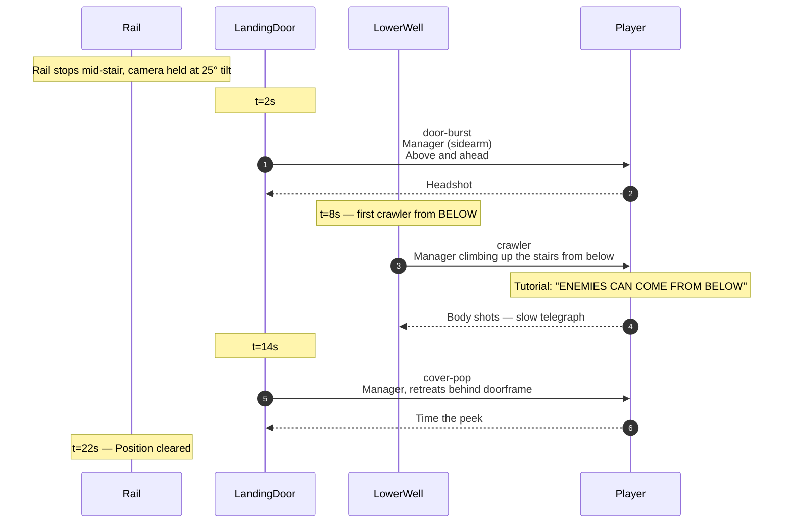
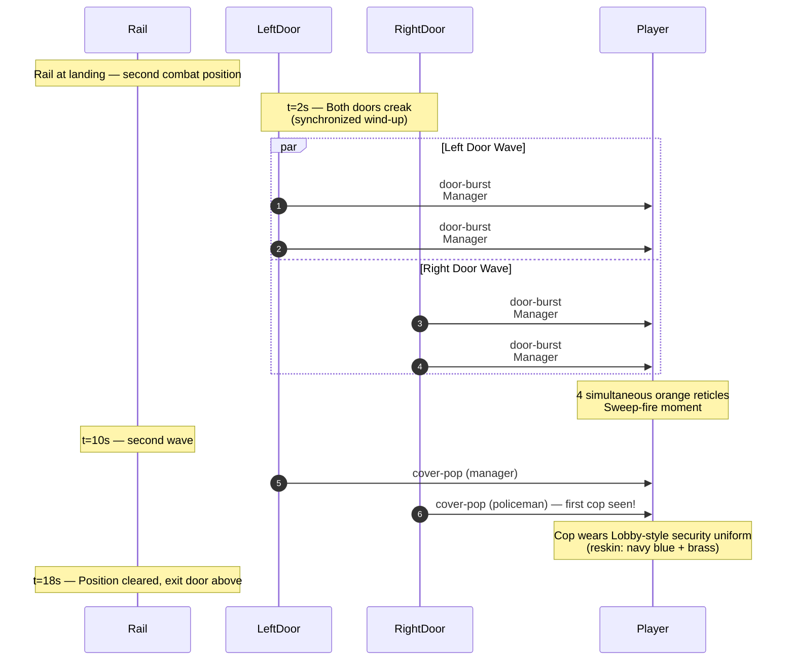

# Level 02 — Stairway A

> The elevator's broken. The auditor takes the stairs. Camera tilts up 25° as the rail begins to climb. A landing door bursts open above; a junior manager stumbles out with a coffee mug, sees the auditor, panics, fires.

## Theme

Concrete and metal — the back-of-house service stairwell. Industrial green metal handrails, exposed pipes overhead, fluorescent tube lights flickering, "THIS IS A FIRE EXIT" signage. Echoey footsteps; the ambience layer drops to almost nothing during traversal so the player hears their own boots on metal stairs.

The visual identity here is **vertical**. The cubicle floor was horizontal corridors; the stairway is straight UP. Camera tilt makes this immediate.

## Time budget

**Target: 60 seconds Normal**, comprising:

| Element | Seconds |
|---|---|
| Tilt transition + climb-start | 4 |
| Mid-stair combat position | 22 |
| Continued climb to landing | 12 |
| Landing-door wave | 18 |
| Top-of-stairs glide to next biome boundary | 4 |
| **Total** | **60s** |

This is the shortest level (Stairway A is gentle by design). Stairways B and C are longer.

## Rail topology

```mermaid
graph TB
    Top([🚪 Top<br/>Open Plan<br/>Door<br/>EXIT])
    Wave[🎯 Pos 2<br/>Landing Door<br/>Wave<br/>18s]
    Mid[🎯 Pos 1<br/>Mid-Stair<br/>22s]
    Bottom([🛗 Lobby<br/>Elevator<br/>SPAWN])

    Bottom -- "4s tilt + climb" --> Mid
    Mid -- "12s climb" --> Wave
    Wave -- "4s exit" --> Top

    style Bottom fill:#1a3050,stroke:#fff
    style Top fill:#3a3050,stroke:#fff
    style Wave fill:#502020,stroke:#f00
```

Rail length: ~14 world units of vertical climb. Camera pitch: -25° (looking up).

## Combat Position 1 — Mid-Stair

### Setup

Halfway up the first flight. Two doors visible: one on the upper landing (closed, source of the next beat-set), one on a tiny intermediate landing (background dressing, never opens).

Tutorial overlay (only on first-ever stair encounter): "ENEMIES CAN COME FROM BELOW TOO" — appears when the first crawler beat fires.

### Encounter flow

### Beat list (Normal)

| t | Beat | Enemy | Notes |
|---|---|---|---|
| 2.0s | door-burst | manager | Upper landing door |
| 8.0s | crawler | manager | From lower stairwell well — first time player sees this beat |
| 14.0s | cover-pop | manager | Same upper door, retreats |

Three enemies, all managers. No civilians. The crawler beat is the new vocabulary introduction.

## Combat Position 2 — Landing-Door Wave

### Setup

Top of the first full flight. The rail has climbed past the intermediate landing. A second flight continues up to the right; the player will exit through the door at the top of this new landing. But first, that door opens — and so does the door across the landing.

Both doors burst open simultaneously: the wave beat. 4-6 enemies pour onto the landing in a coordinated pop.

### Encounter flow

### Beat list (Normal)

| t | Beat | Enemy | Notes |
|---|---|---|---|
| 2.0s | door-burst (×2) | manager + manager | Left landing door |
| 2.0s | door-burst (×2) | manager + manager | Right landing door (synchronized) |
| 10.0s | cover-pop | manager | Left door cycle |
| 10.0s | cover-pop | policeman | Right door cycle — FIRST POLICEMAN of the run |

Six enemies; the synchronized 4-pop is the climax of Stairway A. Introduces the policeman archetype.

## Set pieces

1. **The 25° tilt transition.** When the rail leaves the Lobby and enters the stairway, the camera smoothly tilts up over ~1 second. This is the "you are now ascending" cue. Reverse tilt happens at the top of the stairway as the rail enters Open Plan.

2. **The crawler from below (Pos 1, t=8s).** First time the player sees enemies coming from low Y. Tutorial-grade beat — the wind-up is generous (1.5s) and the enemy is visible climbing up the stairs.

3. **The synchronized landing wave (Pos 2, t=2s).** First time the player sees a synchronized multi-door pop. Sets up the mass-pop vocabulary that returns later in cubicle floors.

## Civilians

None. Stairways are service corridors — no office workers walk through. This is also a player-friendly choice — the tilted camera makes civilian recognition harder, and the player is still learning the verb set.

## Pickup placement

| Position | Pickup | Spawn |
|---|---|---|
| 1 | water cooler in stairwell well (crate-pop) | Drops a small ammo refill |
| 2 | none — the wave is too dense for distractions |

## Audio

- **Ambience layer**: minimal during traversal (echoing footsteps + dripping pipes synth) — `ambience-managers-only.ogg` faded to ~30%
- **Tilt transition**: subtle whoosh + low rumble
- **Crawler from below**: footsteps on metal, panting (background-shamble audio reused)
- **Wave doors creak**: door-creak sound from `pl_inventory_open_01.ogg` placeholder
- **Top of stairs**: ambience layer crossfades to Open Plan's `ambience-radio-chatter.ogg`

## Memory budget

Persistent from Lobby: hands, staple-rifle, manager GLB, manager material LUT entries. Loaded for Stairway A: metal-stairs GLB (existing `staircase-1.glb`), industrial-pipes prop, fluorescent-tube prop, 2 stairwell-door textures (from retro doors pool), policeman GLB (first time loaded — use this stairway as the policeman pre-load slot for Open Plan).

Total VRAM during Stairway A: ~25 MB (5 MB net add over Lobby; -10 MB Lobby-exclusive disposed during stair entrance, +15 MB for staircase + policeman load).

## Authoring notes for implementation

- Camera tilt MUST be smooth, not stepped. Use a `useFrame` lerp over 1.0 second.
- The crawler enemy's climb animation needs to read clearly — use `walk` state on the existing manager but pitch the model -45° forward as a hack until proper crawl animations land.
- The synchronized wave needs both door wind-ups to start within 50ms of each other — humans perceive ≥80ms gap as "not synchronized." Use a single timer to gate both.
- The policeman first appearance is a structural moment — don't hide it. Make sure the policeman is the LAST enemy to die in the wave so the player gets a clean look at the new archetype.

## Validation

- Average Stairway A clear time on Normal: 55-65s
- Crawler beat success rate (player kills before lunge): >85% on Normal (this is a tutorial beat)
- Policeman archetype recognition on first appearance: subjective playtest, but should NOT be missed. If playtests show players don't notice, slow the policeman's spawn animation.
