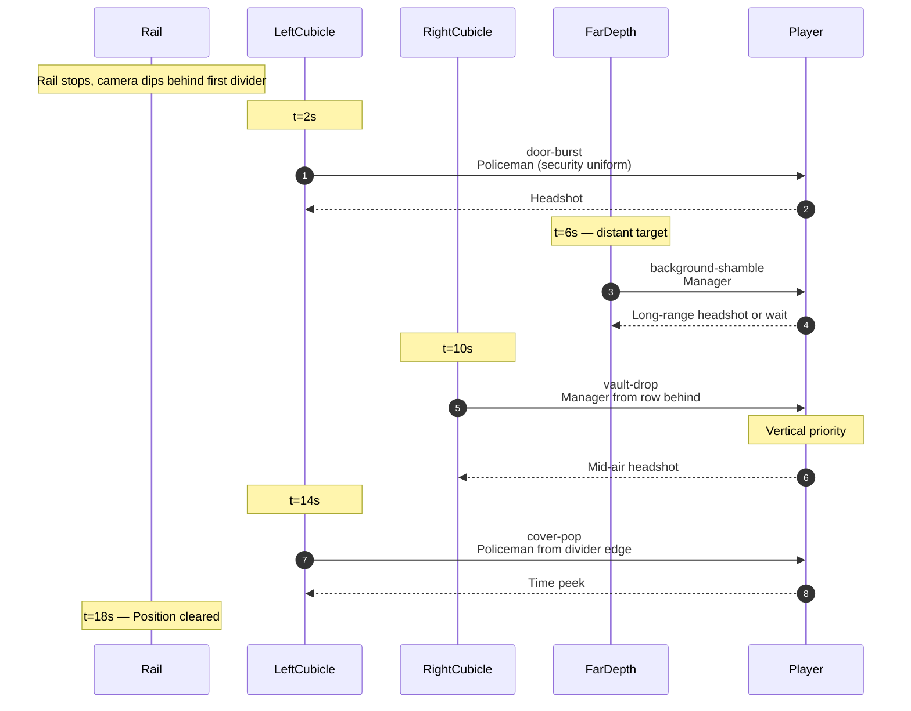
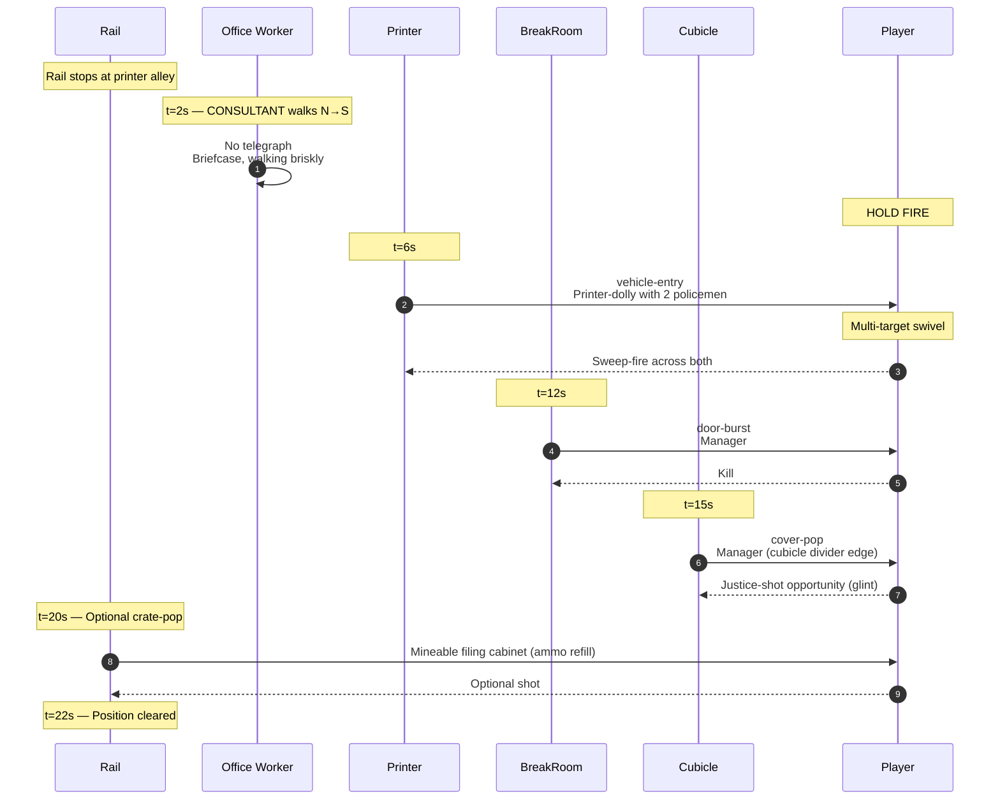
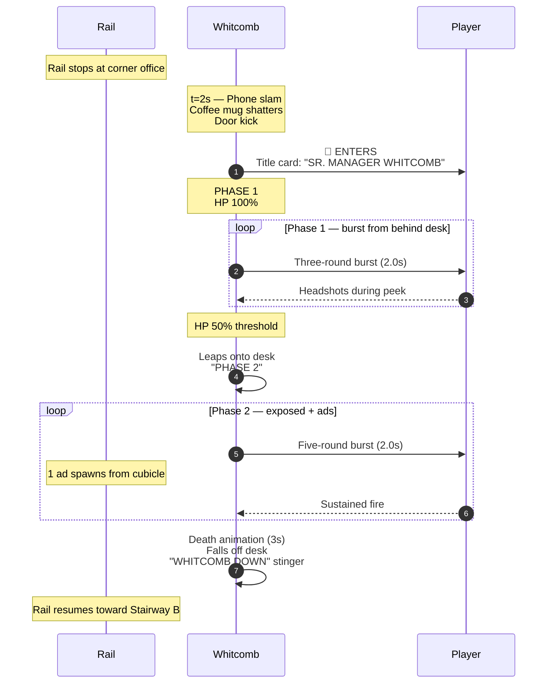

# Level 03 — The Open Plan

> Forty cubicles in three rows, every one identical, every one a potential ambush. The auditor walks the central aisle. A senior manager named Whitcomb runs the floor. Whitcomb believes in "synergy." Whitcomb is going to die.

## Theme

The cubicle sea. Acoustic-tile carpet, beige walls, sea-foam green cubicle dividers about chest-high. Every desk has a computer (CRT, dust). Plants on every fourth desk (the green ones, slightly dying). Above the cubicles: fluorescent tube grid in a 6m grid pattern. Near the far end, a glass-walled corner office labeled "WHITCOMB."

Visual identity: **horizontal claustrophobia.** The cubicle dividers create lots of vault-drop and cover-pop opportunities. The cubicle aisle is the rail. Visually wider than the Lobby but functionally tighter — every divider is potential cover for an enemy.

## Time budget

**Target: 75 seconds Normal**, comprising:

| Element | Seconds |
|---|---|
| Stairway A exit + tilt-down + ambience swap | 3 |
| Combat Position 1 — opening row | 18 |
| Glide to position 2 (~5 units) | 4 |
| Combat Position 2 — printer alley | 22 |
| Glide to position 3 (~5 units) | 4 |
| Combat Position 3 — Senior Manager Whitcomb | 22 |
| Exit to Stairway B | 2 |
| **Total** | **75s** |

## Rail topology

```mermaid
graph LR
    Start([🚪 Stairway A<br/>Exit<br/>SPAWN])
    P1[🎯 Pos 1<br/>Opening Row<br/>18s]
    P2[🎯 Pos 2<br/>Printer Alley<br/>22s]
    P3[💀 Pos 3<br/>Sr. Manager<br/>Whitcomb<br/>22s]
    End([🚪 Stairway B<br/>EXIT])

    Start -- "3s" --> P1
    P1 -- "4s glide" --> P2
    P2 -- "4s glide" --> P3
    P3 -- "2s" --> End

    style Start fill:#1a3050,stroke:#fff
    style End fill:#3a3050,stroke:#fff
    style P3 fill:#502020,stroke:#f00
```

Rail length: ~24 world units. Camera: level (no tilt).

## Combat Position 1 — Opening Row

### Setup

The first three cubicles, two on the left, one on the right with a wide gap. Each cubicle has a door (always closed initially). Whiteboards on the walls behind the cubicles list "GOALS Q1 2026: SYNERGY ACTUALIZATION."

### Encounter flow

### Beat list (Normal)

| t | Beat | Enemy | Notes |
|---|---|---|---|
| 2.0s | door-burst | policeman | Left cubicle |
| 6.0s | background-shamble | manager | Far down the aisle |
| 10.0s | vault-drop | manager | Right side, from row behind |
| 14.0s | cover-pop | policeman | Left cubicle divider |

Four enemies. Mix of manager + policeman. Establishes Open Plan's vault-drop tempo.

## Combat Position 2 — Printer Alley

### Setup

A cluster of office printers on the right side of the aisle (large, beige, paper trays). On the left, a "BREAK ROOM" door. Cubicles continue in three rows behind the printers. A water cooler stands at the divider between this position and the next.

The printers are visual cover for cover-pop beats AND mineable (crate-pop). One printer rolls forward as part of the vehicle-entry beat (dolly with two policemen on it).

### Encounter flow

### Beat list (Normal)

| t | Beat | Enemy / Type | Notes |
|---|---|---|---|
| 2.0s | civilian | consultant | DO NOT SHOOT |
| 6.0s | vehicle-entry | policeman + policeman | Printer-dolly |
| 12.0s | door-burst | manager | Break Room door |
| 15.0s | cover-pop + justice-opportunity | manager | Glint on weapon-hand |
| 20.0s | crate-pop | filing cabinet (optional) | Ammo |

Four enemies + 1 civilian + 1 optional crate. The vehicle-entry beat introduces the new vocabulary — it's Open Plan's signature beat type.

## Combat Position 3 — Mini-Boss: Senior Manager Whitcomb

### Setup

The corner office is glass-walled. Through the glass, the player can see Whitcomb's silhouette: a tall man in a beige suit, holding a coffee mug, gesturing at someone unseen on a phone. As the rail stops, Whitcomb slams the phone down, shatters his coffee mug against the wall, and kicks the glass office door open.

### Whitcomb's spec

A senior-manager reskin of the manager archetype: same GLB, larger scale (1.15×), beige suit material, red power tie, glasses prop. Coffee mug in left hand initially; he throws it as a visual cue at fight start (does no damage; theatrical).

| Difficulty | HP | Phase 1 attack | Phase 2 attack |
|---|---|---|---|
| Easy | 100 | Sidearm shot every 1.8s | Three-round burst every 2.5s |
| Normal | 150 | Three-round burst every 2.0s | Five-round burst every 2.0s + 1 ad |
| Hard | 200 | Five-round burst every 2.0s | Five-round burst every 1.5s + 2 ads |
| Nightmare | 260 | Five-round burst every 1.5s + 1 ad | Spray + 3 ads + lob |
| Ultra Nightmare | 320 | Spray + 2 ads | Spray + 4 ads + lob + cover-pop |

Phase 1: Whitcomb fires from behind his desk (cover). Player must time peeks against burst windows.

Phase 2 (HP threshold 50%): Whitcomb leaps onto the desk, fires more aggressively. Ads spawn from adjacent cubicles.

Weakpoint: head (250 score) or red tie (300 score — comedic). Justice-shot disarms the sidearm.

### Encounter flow

## Set pieces

1. **The vehicle-entry beat (Pos 2, t=6s).** First time the player sees a multi-target swivel scene. Printer-dolly is a comedic choice; visually distinct from anything in the Lobby.

2. **Whitcomb's phone slam (Pos 3 entry).** The visual cue signals the boss fight. The coffee mug shattering is timed to the title card animation.

3. **Whitcomb leaping onto the desk (Phase 2 transition).** Immediate visual cue that danger has escalated. The desk leap also exposes the red-tie weakpoint.

## Civilians

| Position | Civilian | Archetype |
|---|---|---|
| 1 | none | — |
| 2 | consultant | random: bald-suited or grey-skirt |
| 3 | none (boss fight) | — |

## Pickup placement

| Position | Pickup |
|---|---|
| 1 | none |
| 2 | filing cabinet (ammo refill) — crate-pop |
| 3 | Whitcomb Tie (cosmetic) — auto-collect on Whitcomb death |

## Audio

- **Ambience layer**: `ambience-radio-chatter.ogg` (the "open-plan" canonical layer)
- **Whitcomb phone slam**: heavy-impact thud + glass shatter
- **Whitcomb leap onto desk**: stomp + chair clatter
- **Death stinger**: brief brass fanfare + workplace bell

## Memory budget

Persistent: hands, staple-rifle, manager + policeman GLBs. Loaded for Open Plan: cubicle-divider GLB (instanced 12-15 times), printer GLB (instanced 4 times), fluorescent-tube ceiling, water-cooler GLB (instanced 2 times), break-room door, glass-corner-office GLB, Whitcomb material LUT.

Total VRAM during Open Plan: ~32 MB.

Disposal: when entering Stairway B, dispose all Open Plan-exclusive geometry (printers, cubicle dividers, fluorescent tubes, water coolers, corner office). Keep manager + policeman GLBs loaded (reused in HR Corridor).

## Authoring notes

- Whitcomb's "synergy actualization" reading on the whiteboard at Position 1 is a plant — the boss is named in his own corporate jargon at the entrance to his floor. Make it readable but not blocking.
- Vehicle-entry's printer-dolly should rumble audibly (low-frequency synth) before it enters the player's view. Cue the player to look right.
- The corner office glass should be visually transparent enough that Whitcomb's silhouette reads from Position 2. This sets up the boss reveal — the player has been seeing him for ~30 seconds before the fight starts.

## Validation

- Average Open Plan clear on Normal: 70-80s
- Civilian-shooting rate at this point: <30% (players have learned by now)
- Whitcomb Phase 2 reach rate: >90% (he should always make it to Phase 2)
- Whitcomb death rate by 30s: ~80% Normal, ~50% Hard, ~25% Nightmare, ~10% UN
