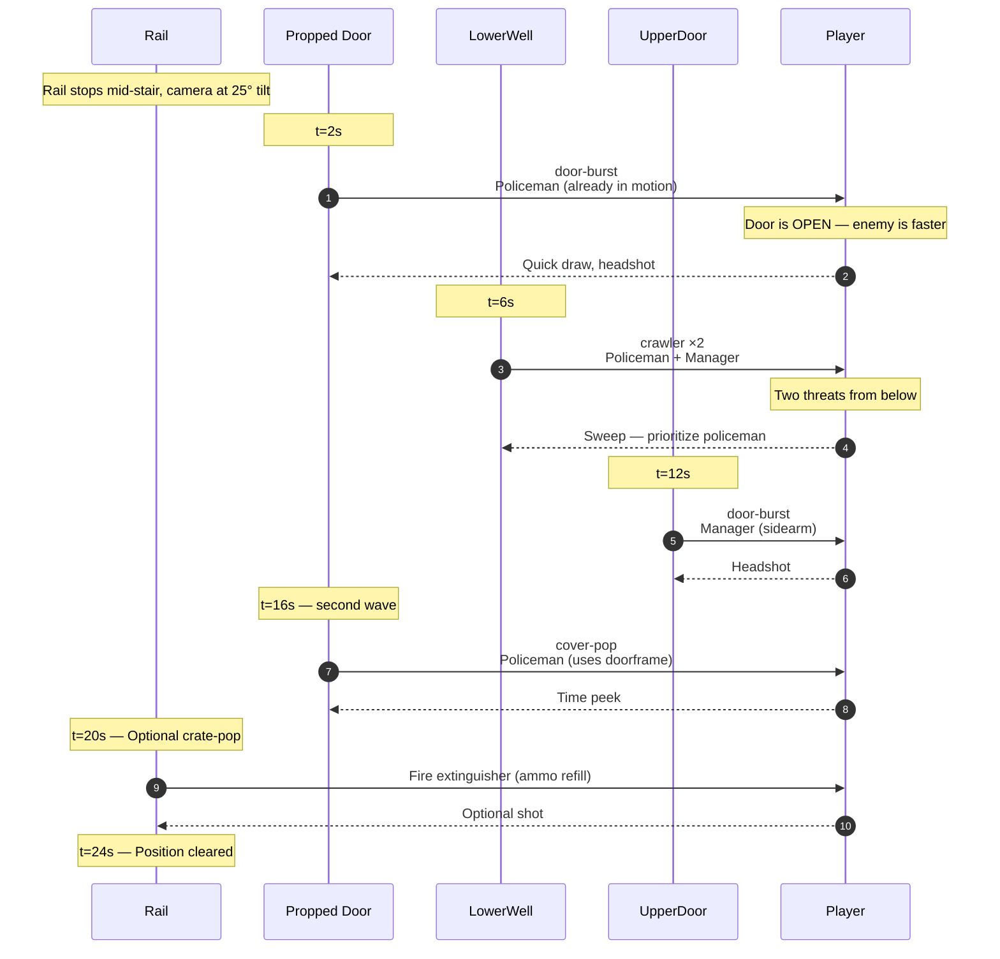
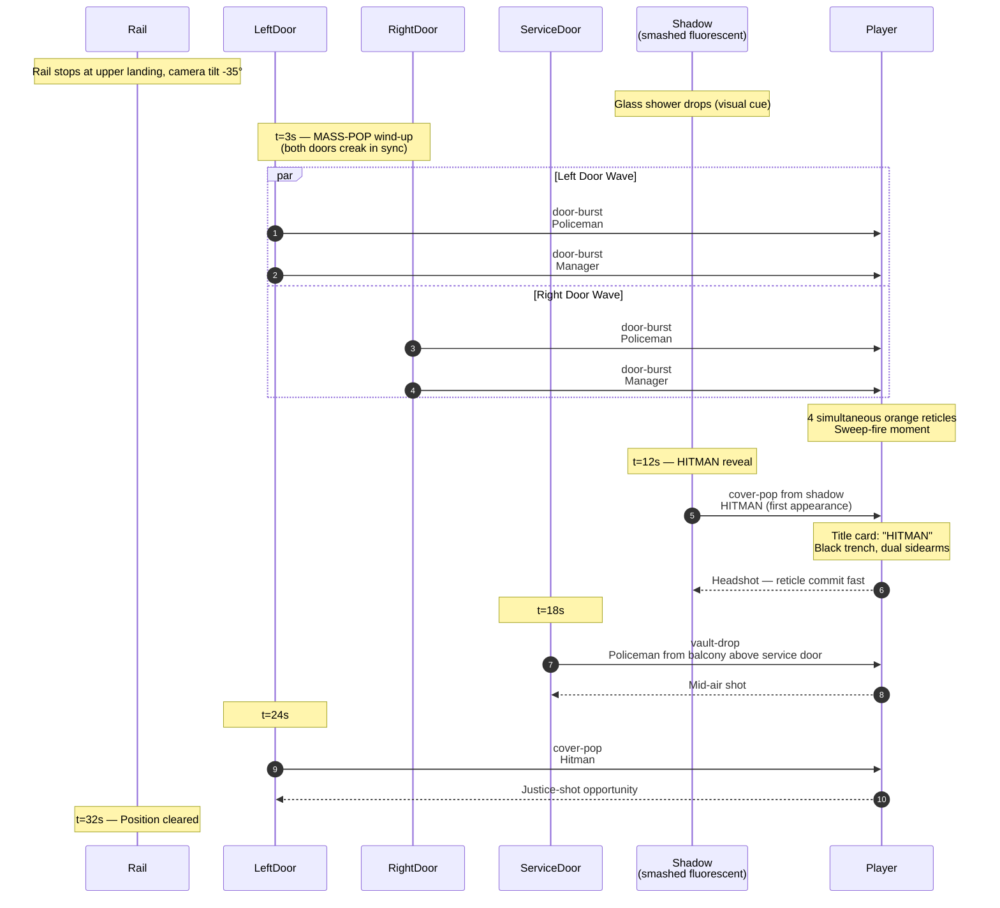

# Level 04 — Stairway B

> Whitcomb's body is barely cold and the building has noticed. The auditor leaves the cubicle floor through Stairway B and the resistance is no longer accidental. Doors are propped open in advance. Policemen waiting in the well. Someone radioed up. The climb is longer this time and the camera knows it.

## Theme

Same industrial palette as Stairway A — concrete, green metal handrails, exposed pipes — but the lighting flickers more aggressively. One overhead fluorescent at the upper landing has been deliberately smashed (the hitman is hiding in that shadow). Graffiti on the wall halfway up: a chalk arrow pointing up with the words "AUDITOR ↑" drawn under it. Someone has been here.

The visual identity is **vertical with intent.** Stairway A was unaware; Stairway B is a planned ambush. The camera's 25° tilt returns, but the upper landing is darker by ~30% than Stairway A.

## Time budget

**Target: 90 seconds Normal**, comprising:

| Element | Seconds |
|---|---|
| Tilt transition + climb-start + ambience swap | 4 |
| Combat Position 1 — lower well | 24 |
| Climb to mid-flight | 6 |
| Combat Position 2 — upper landing mass-pop | 32 |
| Continued climb to HR door | 18 |
| Top exit + ambience swap | 6 |
| **Total** | **90s** |

50% longer than Stairway A. Difficulty rises with both density and beat complexity — this is where the policeman tier becomes the dominant archetype and the first hitman appears.

## Rail topology

```mermaid
graph TB
    Top([🚪 HR Corridor<br/>Door<br/>EXIT])
    P2[🎯 Pos 2<br/>Upper Landing<br/>MASS-POP<br/>32s]
    P1[🎯 Pos 1<br/>Lower Well<br/>24s]
    Bottom([🚪 Open Plan<br/>Stairwell Door<br/>SPAWN])

    Bottom -- "4s tilt + climb" --> P1
    P1 -- "6s climb" --> P2
    P2 -- "18s climb to top" --> Top

    style Bottom fill:#1a3050,stroke:#fff
    style Top fill:#3a3050,stroke:#fff
    style P2 fill:#502020,stroke:#f00
```

Rail length: ~22 world units of vertical climb. Camera pitch: -25° on average; -35° during the upper landing approach to emphasize verticality of the mass-pop.

## Combat Position 1 — Lower Well

### Setup

Halfway up the first flight. Two doors: one upper landing door (closed), one across-the-well door on the intermediate landing (this one is **propped open with a fire extinguisher** — narrative cue that someone wants enemies pouring through). The fire extinguisher is mineable (crate-pop, ammo).

### Encounter flow

### Beat list (Normal)

| t | Beat | Enemy | Notes |
|---|---|---|---|
| 2.0s | door-burst | policeman | Propped door — shorter wind-up (door already open) |
| 6.0s | crawler ×2 | policeman + manager | Synchronized from lower well |
| 12.0s | door-burst | manager | Upper landing door |
| 16.0s | cover-pop | policeman | Propped door cycles |
| 20.0s | crate-pop | fire extinguisher (optional) | Ammo |

Five enemies + 1 optional crate. The synchronized double-crawler is new — Stairway A had a single crawler; Stairway B doubles the threat from below.

## Combat Position 2 — Upper Landing Mass-Pop

### Setup

Top of the second flight, immediately under a smashed fluorescent (the upper landing is partially shadowed). Three doors visible: left, right, and a back-of-landing service door. The smashed fluorescent **drops a shower of glass** on rail entry as a visual cue (no damage, theatrical).

This position introduces the first **hitman** — black trench coat, white skull-print tie, dual sidearms. The hitman uses the shadow under the smashed fluorescent for cover and is harder to see than other archetypes.

### Encounter flow

### Beat list (Normal)

| t | Beat | Enemy | Notes |
|---|---|---|---|
| 3.0s | mass-pop (×4) | policeman + manager + policeman + manager | Synchronized left + right doors |
| 12.0s | cover-pop | hitman | FIRST HITMAN of the run |
| 18.0s | vault-drop | policeman | From above service door |
| 24.0s | cover-pop | hitman | Justice-shot glint |

Seven enemies. The mass-pop is the climax of Stairway B. Hitman introduction is the structural moment — the new archetype must read clearly.

## Set pieces

1. **The propped door (Pos 1).** First time the player sees a door that didn't burst — it was waiting. Subtle environmental storytelling: someone radioed ahead from Open Plan.

2. **The chalk arrow graffiti.** Visible during the climb between positions. Reads: "AUDITOR ↑". The auditor is being hunted now; the building knows.

3. **The smashed fluorescent + glass shower (Pos 2 entry).** The shadow it creates is functional — it hides the hitman. The glass shower is the visual cue that something worse waits in the dark.

4. **The hitman reveal (Pos 2, t=12s).** First appearance of the third enemy archetype. Title card mid-fight, reticle wind-up shorter than policeman, justice-shot disarms one of the dual sidearms (theatrical glint).

## Civilians

None. Stairways remain civilian-free service corridors.

## Pickup placement

| Position | Pickup | Spawn |
|---|---|---|
| 1 | Fire extinguisher (crate-pop) | Ammo refill, optional |
| 2 | None — mass-pop is too dense for distractions |

## Audio

- **Ambience layer**: `ambience-managers-only.ogg` faded to ~25% — quieter than Stairway A. The building is listening.
- **Glass shower**: shatter SFX layered with metallic ping
- **Mass-pop wind-up**: dual door-creak in sync (both doors must start within 50ms — same constraint as Stairway A)
- **Hitman reveal sting**: low strings + bass-drop one-shot, distinct from any earlier audio
- **Top of stairs**: ambience crossfades to HR Corridor's `ambience-fluorescent-hum.ogg`

## Memory budget

Persistent from Open Plan: hands, staple-rifle, manager + policeman GLBs. Loaded for Stairway B: metal-stairs GLB (reused from Stairway A), industrial-pipes prop (reused), 1 propped-door variant, fire-extinguisher prop, **hitman GLB (first time loaded — use this stairway as the hitman pre-load slot for HR Corridor)**.

Total VRAM during Stairway B: ~28 MB (3 MB net add over Stairway A; +3 MB for hitman GLB + dual-sidearm prop, fire-extinguisher amortized).

Disposal: Open Plan exclusives (printers, cubicle dividers, water coolers, Whitcomb material) were already disposed entering Stairway B. Stairway A geometry (stairs, pipes) remains loaded — same biome.

## Authoring notes

- The propped door is a `<group>` with a fire-extinguisher prop blocking the closing animation; the door uses the open-state pose, no animation. Cheap.
- The smashed fluorescent uses a darker emissive value on its tube material (50% of normal fluorescent) and casts a shorter cone of light. Adjacent fluorescents stay normal.
- The hitman's dual-sidearm appearance: same right-hand sidearm prop as policeman + a mirrored left-hand instance. No new prop authoring required for v1.
- The chalk-arrow graffiti is a flat decal mesh with a 256×256 texture. Place it on the wall halfway up the second flight, slightly offset so it's visible during climb but not blocking.
- Mass-pop sync: BOTH doors' wind-up timers start from the same `t0` reference. Use a single setTimeout chain, not parallel ones.

## Validation

- Average Stairway B clear time on Normal: 80-95s
- Mass-pop clear rate (player kills all 4 in window): >70% on Normal — if lower, widen the wind-up window by 200ms
- Hitman archetype recognition on first appearance: subjective playtest, but the title card + reveal sting must register. Slow the reveal animation if playtests miss it.
- Policeman dominance check: at this point, policeman should be the most-killed archetype across the run so far. Manager kills should be plateau-ing.
