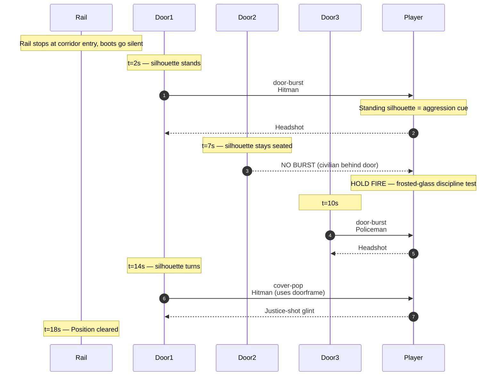
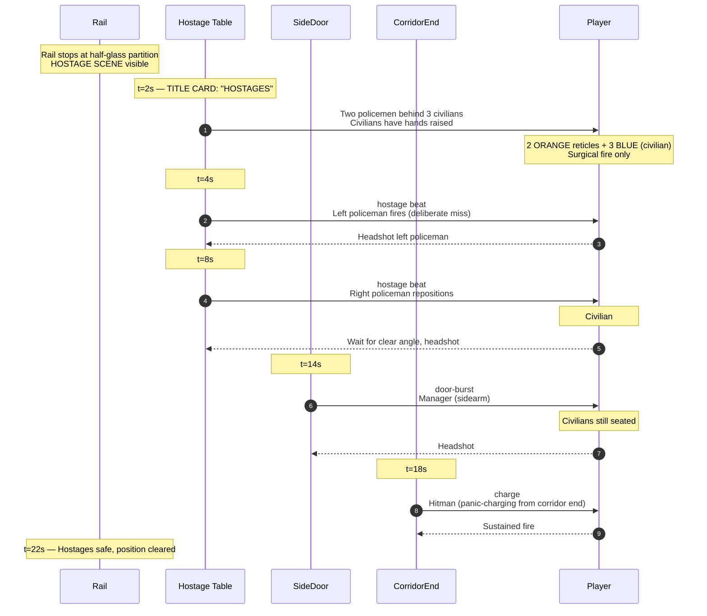
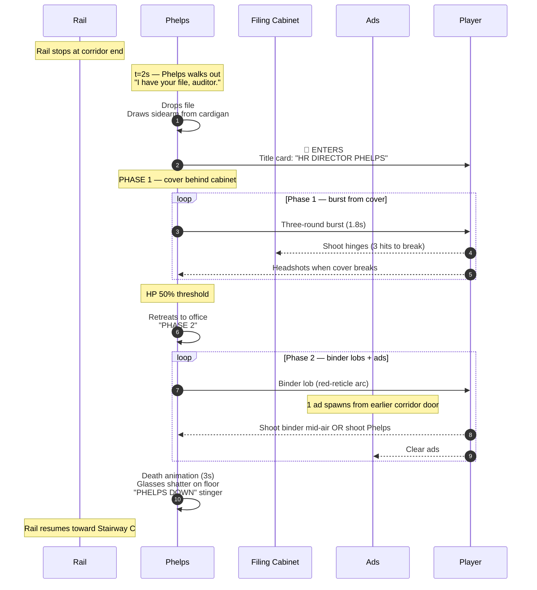

# Level 05 — HR Corridor

> The HR floor is the building's nervous system. Carpet that absorbs sound, motivational posters about "OPEN COMMUNICATION" hung at eye level, and behind every closed door, a closed-door conversation. HR Director Phelps wears a cardigan. Phelps has read every personnel file. Phelps knows the auditor's middle name. Phelps is going to use it.

## Theme

Beige carpet, beige walls, beige everything. The carpet is the loudest design choice — it's beige with a darker beige stripe pattern, swallowing footstep audio entirely (the player's own boots go silent here, which is a deliberate auditory cue). Frosted-glass office doors line the corridor; behind each, a silhouette is visible. Posters: "WE'RE ALL ON THE SAME TEAM," "FEEDBACK IS A GIFT," "REDUNDANCY IS A PROCESS."

Visual identity: **soft surfaces, hard intentions.** The horizontal claustrophobia of Open Plan returns but tighter — the corridor is narrower, doors are closer together, frosted glass means you can see silhouettes BEFORE the door bursts.

## Time budget

**Target: 75 seconds Normal**, comprising:

| Element | Seconds |
|---|---|
| Stairway B exit + ambience swap (boots go silent) | 4 |
| Combat Position 1 — corridor entry | 18 |
| Glide to position 2 (~5 units) | 4 |
| Combat Position 2 — hostage room | 22 |
| Glide to position 3 (~4 units) | 3 |
| Combat Position 3 — HR Director Phelps | 22 |
| Exit to Stairway C | 2 |
| **Total** | **75s** |

## Rail topology

```mermaid
graph LR
    Start([🚪 Stairway B<br/>Exit<br/>SPAWN])
    P1[🎯 Pos 1<br/>Corridor Entry<br/>18s]
    P2[🎯 Pos 2<br/>Hostage Room<br/>HOSTAGE BEATS<br/>22s]
    P3[💀 Pos 3<br/>Director Phelps<br/>22s]
    End([🚪 Stairway C<br/>EXIT])

    Start -- "4s" --> P1
    P1 -- "4s glide" --> P2
    P2 -- "3s glide" --> P3
    P3 -- "2s" --> End

    style Start fill:#1a3050,stroke:#fff
    style End fill:#3a3050,stroke:#fff
    style P2 fill:#503050,stroke:#fa0
    style P3 fill:#502020,stroke:#f00
```

Rail length: ~22 world units. Camera: level (no tilt — back to corridor mode).

## Combat Position 1 — Corridor Entry

### Setup

Three frosted-glass office doors on the left, two on the right. Behind each door, a silhouette is visible. Some silhouettes are seated (civilians, do not shoot through the door); some are standing aggressively (enemies, will burst). The player must read silhouette pose to anticipate.

### Encounter flow

### Beat list (Normal)

| t | Beat | Enemy | Notes |
|---|---|---|---|
| 2.0s | door-burst | hitman | Standing silhouette pre-cue |
| 7.0s | civilian-stayed | (none) | Seated silhouette — DO NOT SHOOT THROUGH |
| 10.0s | door-burst | policeman | Standing silhouette pre-cue |
| 14.0s | cover-pop | hitman | Justice-shot glint |

Three enemies + 1 silhouette-civilian (passive). The silhouette mechanic is HR Corridor's signature — it asks the player to read motion behind frosted glass before the door opens.

## Combat Position 2 — Hostage Room

### Setup

A side-room visible through a half-glass partition (open to the corridor). Inside: an HR conference table, four chairs. **Three civilians are seated at the table, hands behind their heads.** Two policemen with sidearms stand behind them. This is the **first hostage beat** of the run.

The player MUST kill the policemen without hitting the civilians. Any civilian shot here is a -500 score penalty AND triggers a Director Phelps audio sting that he heard it.

### Encounter flow

### Beat list (Normal)

| t | Beat | Enemy / Type | Notes |
|---|---|---|---|
| 2.0s | hostage-setup | 2 policemen behind 3 civilians | Title card |
| 4.0s | hostage-beat | policeman (left) | Surgical headshot |
| 8.0s | hostage-beat | policeman (right) | Wait for clear angle |
| 14.0s | door-burst | manager | Side door |
| 18.0s | charge | hitman | From corridor end |

Four enemies + 3 hostage civilians. The hostage beat is HR Corridor's new vocabulary — civilians are not just walking through, they're staged as living shields.

## Combat Position 3 — Mini-Boss: HR Director Phelps

### Setup

The corridor ends at a frosted-glass door labeled "PHELPS — HR DIRECTOR." As the rail stops, the door swings open from inside; Phelps walks out calmly, holding a personnel file. He says, slowly, "I have your *file*, auditor." He drops the file, draws a sidearm from inside the cardigan.

### Phelps's spec

A new enemy — the "executive" archetype precursor. Same rigging as manager, but in a beige cardigan over white shirt; gray hair, reading glasses on a chain. Carries a personnel file as opening prop, drops it for the fight.

| Difficulty | HP | Phase 1 attack | Phase 2 attack |
|---|---|---|---|
| Easy | 120 | Sidearm shot every 1.5s | Three-round burst every 2.0s |
| Normal | 180 | Three-round burst every 1.8s | Five-round burst every 1.8s + 1 ad |
| Hard | 240 | Five-round burst every 1.8s | Five-round burst every 1.4s + 2 ads |
| Nightmare | 320 | Five-round burst every 1.4s + 1 ad | Spray + 3 ads + lob (binder) |
| Ultra Nightmare | 400 | Spray + 2 ads | Spray + 4 ads + lob + cover-pop |

Phase 1: Phelps fires from cover behind a steel HR filing cabinet rolled into the corridor as makeshift cover. Player must shoot the cabinet's hinges (mineable weakpoint) to remove the cover and expose Phelps.

Phase 2 (HP threshold 50%): Phelps retreats into his office, opens a hidden cabinet of personnel files, and **lobs binders at the player** as a damage-over-time projectile (each binder is a slow-arcing red-reticle target the player can shoot down mid-air for 100 score). Ads spawn from the corridor doors revisiting earlier silhouettes.

Weakpoint: head (250 score) or **glasses** (350 score — comedic, glasses-shatter SFX). Justice-shot disarms the sidearm.

### Encounter flow

## Set pieces

1. **The frosted-glass silhouette read (Pos 1).** First time the player must distinguish enemy intent from a silhouette pose BEFORE the door opens. Standing aggressive = enemy. Seated relaxed = civilian. The cue MUST be visually unambiguous — playtest for read clarity.

2. **The hostage scene (Pos 2).** First time civilians are not just walking through but are staged in danger. The penalty for hitting one is doubled here — and the audio sting from Phelps tells the player he heard the mistake.

3. **Phelps's "I have your file" entrance (Pos 3).** A cold, slow entrance that contrasts with Whitcomb's coffee-throwing rage. Phelps is the calm villain. The dropped file rests on the floor and is shootable for 50 score (comedic, no narrative weight).

4. **The binder lobs (Phase 2).** First time the player encounters a projectile they can shoot down mid-air. Establishes the lob beat vocabulary for use in Boardroom (Reaper's subpoena throw).

## Civilians

| Position | Civilian | Archetype |
|---|---|---|
| 1 | 1 silhouette-civilian (behind frosted door — passive) | random office worker |
| 2 | 3 hostages (seated, hands raised) | random office workers |
| 3 | none (boss fight) | — |

## Pickup placement

| Position | Pickup |
|---|---|
| 1 | Phelps personnel file (cosmetic, 50 score, optional) — at Pos 3 entry |
| 2 | None — too dangerous near hostages |
| 3 | Filing cabinet hinges (mineable cover-break) — Phase 1 mechanic |

## Audio

- **Ambience layer**: `ambience-fluorescent-hum.ogg` — sterile, almost too quiet
- **Boots go silent**: footstep mix attenuated -100% (deliberate auditory cue at corridor entry)
- **Phelps voice line**: dry, low, deliberate cadence. "I have your *file*, auditor." Recorded once, NEVER repeats.
- **Glasses shatter**: high-frequency tinkle on Phelps weakpoint hit
- **Hostage sting**: low brass + heartbeat layer when hostages are in scene
- **Death stinger**: file-folder-thud + filing-cabinet-clang

## Memory budget

Persistent from Stairway B: hands, staple-rifle, manager + policeman + hitman GLBs. Loaded for HR Corridor: HR-corridor-tile floor, frosted-glass-door GLB (instanced 5 times), HR poster prop variants (instanced 3-4 times), filing-cabinet GLB (instanced 1× as Phelps cover, others reused from Workbench prop pool), Phelps cardigan material LUT, hostage chair-set GLB, **executive-tier voice line bank** (shared with future Crawford + Reaper).

Total VRAM during HR Corridor: ~30 MB.

Disposal: when entering Stairway C, dispose all HR-exclusive geometry (frosted doors, posters, hostage chairs, Phelps's cabinet, Phelps's GLB). Keep manager + policeman + hitman GLBs loaded (reused in Executive Suites).

## Authoring notes

- The frosted-glass silhouette pose is a separate billboarded plane behind each door, NOT a real character mesh. Use a low-res silhouette texture per pose (seated, standing-aggressive, standing-passive) and swap it in advance of the beat. This is much cheaper than rendering a hidden full character.
- The boots-go-silent transition is a single audio bus attenuator on rail-cross into the corridor; revert at exit.
- Hostage civilians use the same animation rig as the consultant civilian, but blend-locked to a "hands-raised seated" pose. No need for a new GLB; pose-only variant.
- Phelps's binder-lob projectile reuses the staple-rifle bullet emitter swapped to a binder mesh with arc gravity. The arc must be slow enough that the player has ~1.0s to shoot it down at Normal difficulty.
- The personnel-file dropped-on-floor prop is a static mesh at Phelps's entry position; raycast hit registers a 50-score "joke shot" event.

## Validation

- Average HR Corridor clear on Normal: 70-80s
- **Hostage civilian-shooting rate**: <10% on Normal (this is the strictest checkpoint — the hostage beat must be readable)
- Frosted-glass silhouette read accuracy: >85% — players should NOT be shooting through doors at seated silhouettes
- Phelps Phase 2 reach rate: >85% (cabinet break is the gating skill check)
- Phelps death rate by 30s: ~75% Normal, ~45% Hard, ~20% Nightmare, ~8% UN
