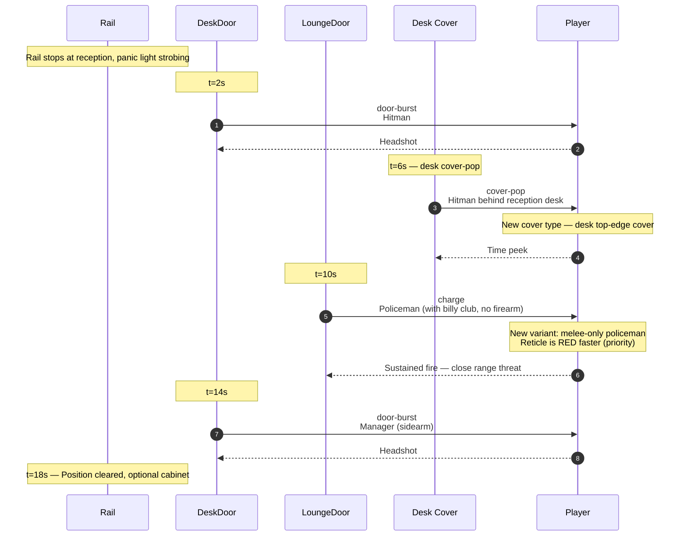
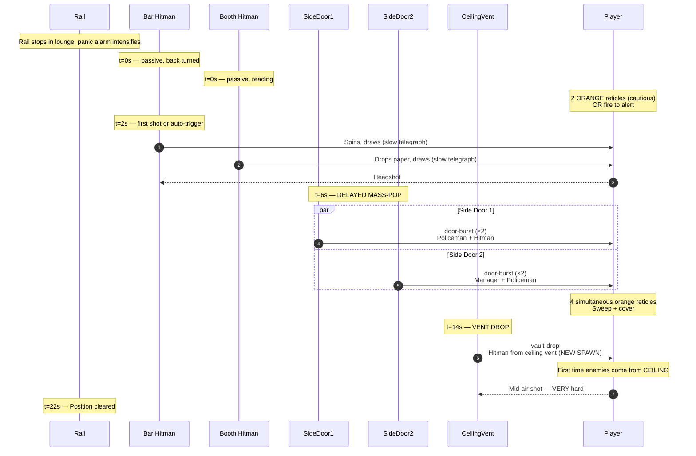
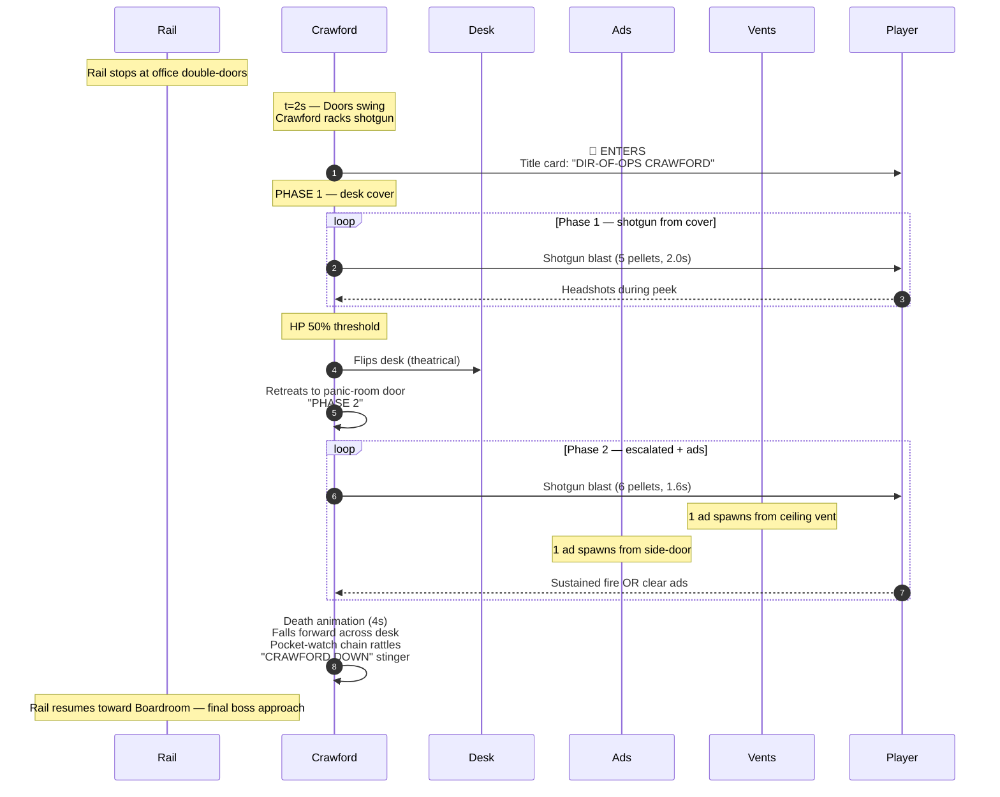

# Level 07 — Executive Suites

> The top floor. Director-of-Operations Crawford's territory. Mahogany double-doors, gold name-plates, a glass-walled executive lounge with a wet bar visible through the partition. The auditor enters and a panic alarm is already wailing — Crawford was warned in advance and is ready. The lounge will be a slaughterhouse.

## Theme

Mahogany walls, brass fixtures, deep green leather chairs, oil paintings of executives so corrupt they're not even named. The executive lounge has a wet bar with brass rails, leather-upholstered booths, a long mahogany conference table, and a panoramic frosted-glass window overlooking the boardroom (final boss arena visible). A panic alarm light strobes red overhead through the entire level.

Visual identity: **opulence + emergency.** The walnut + brass continues from Stairway C, but the strobing red panic light overlays everything. Carpet is plush emerald green. The boardroom is visible through the lounge's far window — the player can SEE where they're going.

## Time budget

**Target: 75 seconds Normal**, comprising:

| Element | Seconds |
|---|---|
| Stairway C exit + panic-alarm activation | 4 |
| Combat Position 1 — outer reception | 18 |
| Glide to position 2 (~5 units) | 4 |
| Combat Position 2 — executive lounge | 22 |
| Glide to position 3 (~4 units) | 3 |
| Combat Position 3 — Director Crawford | 22 |
| Exit to Boardroom | 2 |
| **Total** | **75s** |

## Rail topology

```mermaid
graph LR
    Start([🚪 Stairway C<br/>Exit<br/>SPAWN])
    P1[🎯 Pos 1<br/>Outer Reception<br/>18s]
    P2[🎯 Pos 2<br/>Executive Lounge<br/>MASS-POP<br/>22s]
    P3[💀 Pos 3<br/>Director Crawford<br/>22s]
    End([🚪 Boardroom<br/>FINAL BOSS])

    Start -- "4s" --> P1
    P1 -- "4s glide" --> P2
    P2 -- "3s glide" --> P3
    P3 -- "2s" --> End

    style Start fill:#1a3050,stroke:#fff
    style End fill:#502020,stroke:#f00,stroke-width:3px
    style P3 fill:#502020,stroke:#f00
```

Rail length: ~22 world units. Camera: level (no tilt). Red panic-alarm light strobes globally.

## Combat Position 1 — Outer Reception

### Setup

The executive reception area. A polished mahogany reception desk on the right; behind it, a closed cabinet (mineable, ammo refill). On the left, a row of leather chairs along the wall. Two doors visible: one ahead (to the lounge) and one behind the reception desk (executive-only). The receptionist's desk has a coffee mug, a phone off the hook, and a single dropped earring on the floor — the receptionist fled.

### Encounter flow

### Beat list (Normal)

| t | Beat | Enemy | Notes |
|---|---|---|---|
| 2.0s | door-burst | hitman | Behind reception desk |
| 6.0s | cover-pop | hitman | Reception desk top-edge |
| 10.0s | charge | policeman (billy-club) | Melee-only variant |
| 14.0s | door-burst | manager | Behind reception desk |

Four enemies. The melee-only policeman is a new beat variant — same archetype reskin, different reticle behavior (faster commit, can't be justice-shot since no firearm).

## Combat Position 2 — Executive Lounge

### Setup

A wide lounge: wet bar on the left, conference table center, leather booth seating on the right, panoramic frosted window at the back showing the boardroom silhouette. **Two enemies are already in the lounge** when the rail enters — a hitman at the bar (back to player), a hitman in a booth (reading a newspaper). Neither is alerted yet. The first shot blows the alert.

This position uses the **delayed mass-pop** variant — the alarm goes louder, and over the next ~6 seconds, FOUR additional enemies spill out of doors throughout the lounge. The position is bigger and the threats spread further than Open Plan or HR Corridor.

### Encounter flow

### Beat list (Normal)

| t | Beat | Enemy | Notes |
|---|---|---|---|
| 0-2.0s | passive-pre-aggro | bar hitman + booth hitman | Telegraphed slow draw on alert |
| 6.0s | delayed mass-pop ×4 | policeman + hitman + manager + policeman | Two side doors |
| 14.0s | vault-drop (ceiling) | hitman | First ceiling-vent spawn |

Seven enemies total. The lounge is the largest single-position kill count in any non-boss level. Ceiling vents are a new spawn vocabulary unique to Executive Suites and Boardroom.

## Combat Position 3 — Mini-Boss: Director-of-Ops Crawford

### Setup

Crawford's private office. Mahogany double-doors swing open from inside; Crawford stands behind a hand-carved walnut desk, a glass of bourbon in hand. He sets the bourbon down, pulls a **shotgun** from under the desk, and racks it.

Crawford is the highest-tier human enemy in the run — he uses a shotgun (unique weapon, multi-pellet spread fire), wears a charcoal three-piece suit with a pocket-watch chain, and has a salt-and-pepper beard. Crawford does NOT speak — he just nods grimly, racks the shotgun, and starts firing.

### Crawford's spec

A new boss-tier model — manager rig at 1.2× scale, charcoal-suit material, pocket-watch chain, beard prop. Shotgun prop in right hand. No animations beyond rack-and-fire (fire animation reuses sidearm fire with a wider muzzle flare).

| Difficulty | HP | Phase 1 attack | Phase 2 attack |
|---|---|---|---|
| Easy | 150 | Shotgun blast every 2.2s (4 pellets) | Shotgun blast every 1.8s (5 pellets) + 1 ad |
| Normal | 220 | Shotgun blast every 2.0s (5 pellets) | Shotgun blast every 1.6s (6 pellets) + 2 ads |
| Hard | 300 | Shotgun blast every 1.8s (6 pellets) | Shotgun blast every 1.3s (7 pellets) + 3 ads |
| Nightmare | 400 | Shotgun blast every 1.5s + 1 ad | Shotgun blast every 1.0s + 4 ads + lob |
| Ultra Nightmare | 520 | Shotgun blast every 1.2s + 2 ads | Shotgun blast every 0.8s + 5 ads + lob + cover-pop |

Phase 1: Crawford fires from cover behind his walnut desk. Player must time peeks — shotgun spread is wider than burst-fire bosses, harder to dodge by side-stepping, easier to dodge by ducking.

Phase 2 (HP threshold 50%): Crawford **flips the desk over** (theatrical, becomes additional cover for Crawford) and retreats to his office's panic-room door (the door doesn't open — it just provides closer cover). Ads spawn from ceiling vents and the office side-door. Crawford's fire rate increases.

Weakpoint: head (250 score) or **pocket watch** (400 score — high-skill comedic shot, pocket-watch ping SFX). Justice-shot disarms the shotgun.

### Encounter flow

## Set pieces

1. **The pre-aggro lounge (Pos 2 entry).** First time enemies are visible BEFORE alert. The slow draw on first-shot is a tutorial-grade beat — even at this point in the game, the player gets a brief tactical edge to encourage scanning before firing.

2. **The ceiling vent drop (Pos 2, t=14s).** First ceiling-spawn beat. Establishes a new spawn axis for Boardroom (Reaper's ads come from ceiling vents and floor traps).

3. **Crawford's silent entrance (Pos 3).** Whitcomb screamed; Phelps monologued; Crawford does neither. The silence is the cue. Just a nod and a rack of the shotgun.

4. **The desk flip (Crawford Phase 2).** Theatrical, communicates phase escalation. The flipped desk also functionally narrows the player's clear-LOS window.

## Civilians

| Position | Civilian | Archetype |
|---|---|---|
| 1 | none | — |
| 2 | none — the lounge has been cleared by the building |
| 3 | none (boss fight) | — |

No civilians on the executive floor. The building has actively evacuated them. This is a deliberate narrative beat — the upper-tier enemies are now uncontaminated by civilian-shielding considerations, and the player can fire freely.

## Pickup placement

| Position | Pickup |
|---|---|
| 1 | Reception cabinet (crate-pop, ammo refill, optional) |
| 2 | Wet-bar bottles (mineable, decorative — 25 score per shatter, no gameplay impact) |
| 3 | Crawford's pocket watch (cosmetic, auto-collect on Crawford death) |

## Audio

- **Ambience layer**: `ambience-panic-alarm.ogg` — looping rising-and-falling alarm wail, distinctive from any prior level
- **Crawford voice**: NONE. Silent boss. Only audio is shotgun rack + fire + death rattle.
- **Bourbon-glass set down**: small ceramic clink before the rack
- **Shotgun rack**: distinctive metallic chunk-CHUNK
- **Desk flip**: heavy wood crash + glass-bourbon-shatter
- **Pocket-watch ping**: high-frequency tone on weakpoint hit
- **Death stinger**: low brass dirge + shotgun-fall thud + pocket-watch chain rattle

## Memory budget

Persistent from Stairway C: hands, staple-rifle, manager + policeman + hitman GLBs. Loaded for Executive Suites: mahogany-wall material LUT, executive-desk GLB (instanced 2-3 times), wet-bar GLB, leather-booth GLB, panic-alarm-light material (animated), Crawford material LUT, **shotgun prop GLB (NEW — first weapon variant beyond sidearm; reused in Boardroom by some Reaper ads)**, ceiling-vent GLB, billy-club prop.

Total VRAM during Executive Suites: ~36 MB (3 MB net add — mahogany + shotgun amortized; offset by disposed Stairway C oil paintings + chandelier).

Disposal: when entering Boardroom, dispose all Executive Suites geometry EXCEPT the shotgun prop (Reaper's ads use it). Dispose Crawford material LUT, ceiling vent (Boardroom uses different vent geometry).

## Authoring notes

- Crawford's silent entrance: the audio mix MUST drop the panic-alarm wail to ~30% during his title-card animation. The silence IS the audio cue. Restore alarm to 100% on shotgun rack.
- Shotgun spread mechanic: each blast fires 5 pellet hitscans within a 12° cone. Player can avoid full-damage by being on the cone edge — encourages cover-popping at oblique angles, not head-on peek.
- The desk-flip animation: 1.5 second blend, desk pivots 180° on its near-edge axis. Crawford steps back during the flip (no overlap collision). The flipped desk has new collision geometry as cover.
- Ceiling-vent spawn: enemies appear via instant alpha-fade-in (vent grate has been "removed" during the strobe peak — covers visual cheat). No rope-down animation needed; cheap.
- The boardroom-window peek: the panoramic frosted glass at the back of the lounge shows a silhouette of the Reaper desk from afar. The player has been seeing it for ~25 seconds before the boss fight. Foreshadowing.

## Validation

- Average Executive Suites clear on Normal: 70-80s
- Player health average at Crawford fight start: 40-60% (the ceiling-vent drop in Pos 2 is the attrition spike)
- Crawford Phase 2 reach rate: >85% (his shotgun is dodgeable; player should rarely die in Phase 1)
- Crawford death rate by 30s: ~70% Normal, ~40% Hard, ~15% Nightmare, ~5% UN
- Pre-aggro lounge use rate: subjective playtest — players SHOULD use the brief tactical edge to take down the bar/booth hitmen before the side-door pops. If most players just panic-fire at t=0, slow the alert further.
