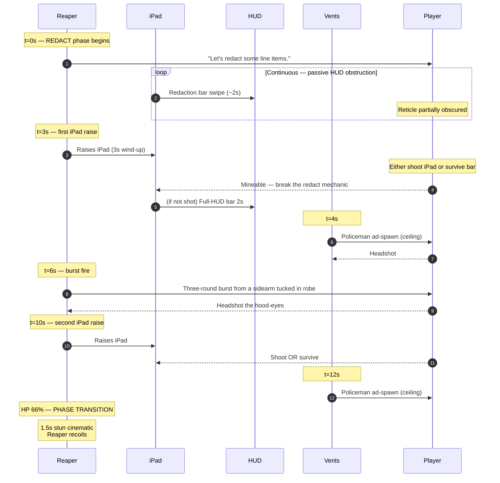
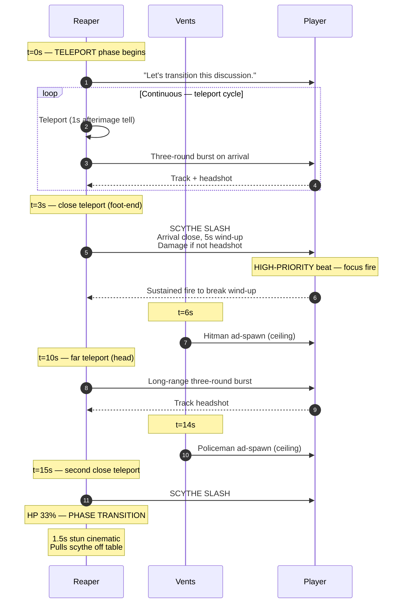
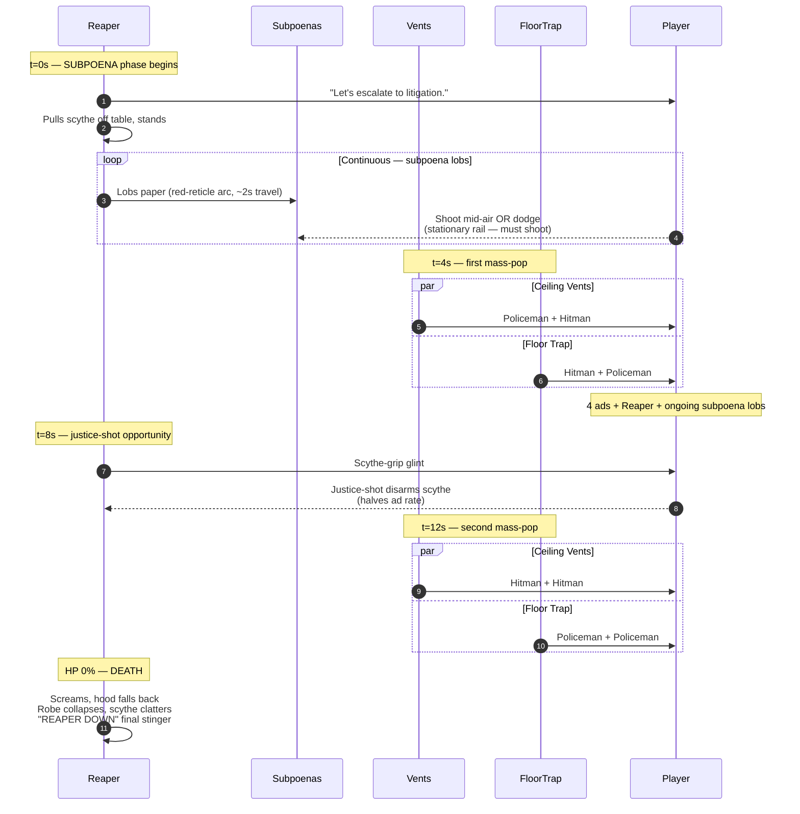

# Level 08 — The Boardroom

> Crawford's body is splayed across his desk. The auditor walks the final corridor toward the boardroom doors. Mahogany doors, twenty feet tall, no nameplate. The doors swing open by themselves. At the head of a thirty-foot conference table sits THE REAPER — black hooded robe, scythe across the table, an iPad in front of it, the screen glowing red. The Reaper looks up. The doors slam shut.

## Theme

A single room. Vaulted ceiling, clerestory windows admitting harsh white light, walnut paneling on every wall, oil paintings of Reapers past (each one identical, anonymous, hooded). The conference table is thirty feet long. At the far end, a black leather executive chair holds the Reaper. Behind the Reaper, a panoramic window shows the city skyline — but the buildings are subtly wrong (slightly too tall, slightly too crooked). On the table: an iPad, a stack of paper subpoenas, a brass bell, a coffee mug labeled "WORLD'S OK BOSS."

Visual identity: **the corporate sublime.** The room is BIG — the player feels small. Every prior level was tight; this one is open. The Reaper is alone at the table; the player is alone at the doors. Two figures in a vast room.

## Time budget

**Target: 60 seconds Normal**, comprising:

| Element | Seconds |
|---|---|
| Door swing + Reaper reveal cinematic | 6 |
| Phase 1 — REDACT | 18 |
| Phase 2 — TELEPORT | 18 |
| Phase 3 — SUBPOENA | 18 |
| **Total** | **60s** |

This is the shortest level by total time, but the highest difficulty per second. Expected actual completion times exceed the target on first attempts (most players will die at least once).

## Rail topology

The rail is **stationary** for the entire fight. The player's position is the boardroom doorway, looking down the conference table. The Reaper moves; the player does not. Camera tilts and rotates with Reaper position changes (within ±20° yaw bounds) but the rail node does not advance.

## The Reaper's spec

The final boss. Custom GLB — the only mesh in the game NOT reused from the worker / manager / policeman / hitman / executive lineage.

- **Mesh**: Hooded robe, no visible face (just shadow under the hood with two faint red dots). Bony hands clutching a scythe. Scale: 1.4× standard worker.
- **Material**: Pure black robe with subtle volumetric texture, red dots emissive at 5.0 intensity in the hood-shadow.
- **Voice**: Deep, processed, distorted vocoder — not human. Speaks in corporate jargon turned menacing.

| Difficulty | Total HP | Phase splits | Notes |
|---|---|---|---|
| Easy | 400 | 132 / 132 / 132 | Generous |
| Normal | 600 | 200 / 200 / 200 | Baseline |
| Hard | 850 | 283 / 283 / 283 | Tight DPS check |
| Nightmare | 1100 | 366 / 366 / 366 | Required adaptive-difficulty bonus |
| Ultra Nightmare | 1500 | 500 / 500 / 500 | Memorization required |

Boss HP is NOT scaled by the global difficulty multiplier — these are absolute values per the boss-HP exception in `03-difficulty-and-modifiers.md`.

### Phase transition behavior

- HP 100% → 66%: enters PHASE 1 (REDACT)
- HP 66% → 33%: brief stun cinematic (1.5s — Reaper recoils, ipad cracks slightly), enters PHASE 2 (TELEPORT)
- HP 33% → 0%: brief stun cinematic (1.5s — Reaper pulls scythe off table), enters PHASE 3 (SUBPOENA)
- HP 0%: death cinematic (4s — Reaper screams, hood falls back revealing nothing, robe collapses, scythe clatters)

### Weakpoints

- Hood-shadow red dots (the eyes): 500 score per hit, 2× damage multiplier
- Scythe handle: justice-shot disarms the scythe (Phase 3 only — scythe disarm reduces ad spawns)
- iPad on table (Phase 1 only): mineable, 800 score, breaks REDACT mechanic for that phase

## Phase 1 — REDACT

### Setup

The Reaper sits at the table. The iPad screen glows red. The Reaper says: "Let's *redact* some line items." Periodically, **black redaction bars** sweep across the player's HUD horizontally — partially obscuring the reticle and threat indicators. The bars are temporary (~2 seconds each) but they make targeting harder.

The Reaper stands periodically and **points the iPad at the player** — a 3-second wind-up that fires a long horizontal redaction bar that crosses the entire HUD on commit. Player must shoot the iPad mid-wind-up (mineable) OR break LOS (impossible — rail is stationary) OR just survive.

Ads: TWO **policemen** spawn from the rear-of-room ceiling vents at t=4s and t=12s.

### Encounter flow

### Phase 1 beat list

| t | Beat | Effect | Notes |
|---|---|---|---|
| 0-18s | passive HUD obstruction | Redaction bars sweep | ~2s each, intermittent |
| 3.0s | iPad raise | 3s wind-up + full-HUD bar | Mineable mid-wind-up |
| 4.0s | ad-spawn (ceiling vent) | Policeman | Standard ad |
| 6.0s | three-round burst | Sidearm fire | From under robe |
| 10.0s | iPad raise | 3s wind-up + full-HUD bar | Mineable |
| 12.0s | ad-spawn (ceiling vent) | Policeman | Standard ad |
| Continuous | hood-eye fire | Reaper aims and fires through phase | Auto-reset bursts |

## Phase 2 — TELEPORT

### Setup

The Reaper says: "Let's *transition* this discussion." The room dims slightly. The Reaper teleports between four positions around the conference table: head, left side, right side, foot-end (the player's end, dangerously close). Each teleport leaves a 1-second red afterimage at the destination as a tell.

Teleport pattern: 4 positions × cycling visit ~3 seconds each. Player must lead the Reaper's teleports to keep the reticle on him.

Ads: ONE **hitman** + ONE **policeman** spawn at ceiling vents at t=6s and t=14s respectively.

### Encounter flow

### Phase 2 beat list

| t | Beat | Position | Notes |
|---|---|---|---|
| 0-18s | teleport cycle | 4 positions | 3s per position, 1s afterimage tell |
| 3.0s | scythe-slash (close) | foot-end | 5s wind-up, requires focus fire |
| 6.0s | ad-spawn | ceiling vent | Hitman |
| 10.0s | far burst | head | Long-range three-round |
| 14.0s | ad-spawn | ceiling vent | Policeman |
| 15.0s | scythe-slash (close) | foot-end | 5s wind-up |

## Phase 3 — SUBPOENA

### Setup

The Reaper says: "Let's *escalate* to litigation." Pulls the scythe off the table and stands at the head of the table. From the stack of paper subpoenas, **lobs subpoenas as projectiles** in red-reticle arcs (player can shoot them mid-air for 200 score each). The Reaper does not teleport in this phase but moves at half-speed left/right at the table head.

Final-act intensity: continuous **mass-pop ads** from ceiling vents AND from a hidden floor trap at the far end of the table — 4 enemies per wave, two waves total during the phase.

If justice-shot disarms the scythe: ad spawn rate halves for the remainder of the phase.

### Encounter flow

### Phase 3 beat list

| t | Beat | Source | Notes |
|---|---|---|---|
| 0-18s | subpoena lob | Reaper | Continuous, ~2s travel, mid-air shootable |
| 4.0s | mass-pop ×4 | ceiling + floor | 2 ads each from vents and trap |
| 8.0s | justice-opportunity | Reaper scythe | Disarm halves ad rate |
| 12.0s | mass-pop ×4 | ceiling + floor | 2 ads each |
| Continuous | hood-eye fire | Reaper | Three-round bursts |

## Set pieces

1. **The door slam (Reveal).** The 20-foot mahogany doors swing inward, the Reaper's silhouette is visible at the far end, then the doors SLAM shut behind the player. Music drops to silence for 1 second; then the boss theme fires.

2. **The redaction bars (Phase 1).** First time the player's HUD itself is the obstacle. Establishes "the Reaper attacks the medium, not just the player."

3. **The teleport tell (Phase 2).** The 1-second afterimage at the destination is the player's only way to predict the Reaper's next position. Players who learn this read win consistently.

4. **The scythe-pull (Phase 2 → Phase 3 transition).** Reaper pulls the scythe OFF the table, the iPad slides aside. Visual escalation that the close-range threat is now permanent.

5. **The hood-falls-back death (Final).** When the Reaper dies, the hood falls back to reveal NOTHING — empty robe. The robe collapses inward like a dropped towel. Scythe clatters to the table. No body. The Reaper was never there.

## Civilians

None. The Reaper has dismissed all support staff. This is a duel.

## Pickup placement

| Phase | Pickup |
|---|---|
| Phase 1 | iPad (mineable, 800 score, breaks redact mechanic) |
| Phase 2 | None (constant motion) |
| Phase 3 | Reaper's scythe (mineable via justice-shot, halves ad rate) |

After victory: **The Reaper's scythe** auto-collects as cosmetic for victory screen. The robe collapses around it.

## Audio

- **Pre-fight ambience**: dead silence in the boardroom approach. Footsteps echoey but quiet.
- **Door swing**: massive low rumble + creak (custom SFX)
- **Door slam**: thunderclap-tier impact + dust-puff visual cue
- **Reaper voice**: deep vocoder-processed delivery; lines: "Let's redact some line items." / "Let's transition this discussion." / "Let's escalate to litigation." / [scream on death]
- **Boss theme**: slow corporate-orchestral build with industrial percussion. Three-section structure matching the three phases (each phase swap retains the theme but changes meter and instrumentation).
- **Redaction bar swipe**: tape-rewind-style high-frequency whir
- **Teleport**: low whoosh + bass drop
- **Scythe slash wind-up**: rising metallic whine
- **Subpoena lob**: paper-rustle + brass-bell gong on commit
- **Death scream**: layered vocoder + reverb + brass dirge

## Memory budget

Persistent from Executive Suites: hands, staple-rifle, manager + policeman + hitman GLBs (used for ads), shotgun prop. Loaded for Boardroom: Reaper GLB (NEW — only loaded for this level), Reaper material LUT (red emissive eyes), boardroom-table GLB (single instance, large), boardroom-walls + clerestory-windows + city-skyline backdrop, scythe prop, subpoena projectile prop, iPad prop, ceiling-vent (different geometry from Executive Suites), floor-trap GLB.

Total VRAM during Boardroom: ~38 MB (peak of any level — the Reaper + scythe + boardroom uniqueness costs roughly 4 MB net add).

Disposal: NOT applicable — this is the final level. Cleanup happens on level fade-out → victory screen.

## Authoring notes

- The Reaper GLB is the ONLY custom-authored model required for the alpha. Everything else reskins existing rigs. This is the budget priority — get the Reaper right.
- The hood-shadow red eyes use a separate emissive sphere mesh inside the hood, with ambient occlusion to create the shadow falloff. Don't try to do it in shader on the hood-mesh itself; cheap and uncanny via the discrete-emitter approach.
- Redaction bars: SVG/DOM elements drawn on top of the canvas, NOT in-engine — this keeps them at full screen-space sharpness regardless of resolution. Position via `position: absolute` over the canvas viewport.
- Teleport afterimage: clone of the Reaper mesh with red unlit material, alpha 0.6 → 0 over 1.0s. Use a single fixed afterimage instance, repositioned each teleport.
- Subpoena projectile: small flat rectangular prop with subtle paper-flutter shader (sine displacement on 2 vertices). Arc gravity = 9.8 m/s² with 0.5s flat-arc ease.
- Scythe-slash wind-up: 5s on Normal is generous — the player WILL die to it on first encounter without learning to focus-fire. This is an intentional teaching beat.
- Final hood-falls-back: do this with a one-shot animation on the Reaper's hood-bone (no IK), and a robe-collapse animation that uses two cloth-like keyframes (no real cloth sim — it's authored).
- Boss theme MUST loop seamlessly per phase; transitions between phases are quick crossfades (~1s).

## Validation

- Average Boardroom clear on Normal: 70-90s (bosses overrun the 60s target on first attempt — expected)
- Phase 1 first-attempt clear rate: ~70% (the redact bars + ads is digestible)
- Phase 2 first-attempt clear rate: ~50% (scythe-slash teaching beat kills players who don't focus-fire)
- Phase 3 first-attempt clear rate: ~40% (mass-pop + subpoena lobs + Reaper fire is the danger peak)
- Overall first-attempt boss clear: ~30% on Normal (per the difficulty validation in `03-difficulty-and-modifiers.md`)
- Average attempts to first clear on Normal: 3-5
- Total run completion target on Normal: ~35% of players reach Reaper, ~10% kill Reaper first run
- The hood-falls-back-empty death cinematic is a structural beat — it MUST land. Allocate authoring time accordingly.
